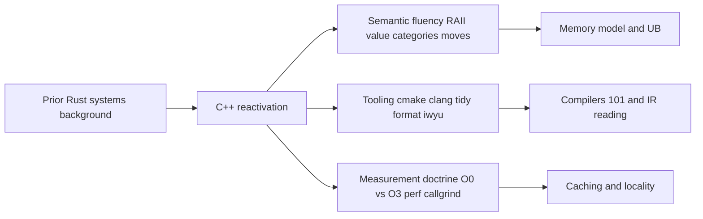

# Module 1 — C++ Reactivation and Tooling

Why this matters for Lemurian Labs
- ML compilers and runtimes live at the boundary of language semantics and hardware realities. You must read unfamiliar C++ quickly, spot UB and lifetime issues, and reason about what optimizes to what.
- Early-stage teams need engineers who build small, surgical experiments, measure with rigor, and iterate fast. This module establishes your measurement and tooling discipline for the rest of the program.

Key outcomes
- Build and run a CMake C++23 project with a microbenchmark harness and profiling enabled.
- Explain RAII, value categories, move semantics, and rule of 0 3 5 tradeoffs; identify where copy elision and RVO apply.
- Use clang-tidy, clang-format, include-what-you-use, and Compiler Explorer to review and improve code and codegen.
- Keep the optimizer honest (-O0 vs -O3, -march=native, -fno-inline, DoNotOptimize and ClobberMemory) and produce evidence using perf and callgrind.
- Contrast Rust ownership/borrowing with C++ RAII/move/aliasing and exceptions vs error codes.

Concept map


Prerequisites and environment
- Linux, clang 17+ and gcc 12+, CMake 3.24+.
- perf, valgrind (callgrind and cachegrind), include-what-you-use, clang-tidy, clang-format.
- Optional: SYCL CPU toolchain (oneAPI dpcpp or hipSYCL) if you want to try the GPU alt lab on CPU.
- Export compile_commands.json via CMake for tooling integration.

Reference outline
- This chapter implements Module 1 from the program outline in [C++_Lecture/phase1_outline.md](C++_Lecture/phase1_outline.md).

---

## Core content

1) RAII and lifetimes (scope-bound resources, deterministic cleanup, and correctness under optimization)
- What RAII solves:
  - Scope-bound ownership ensures resources (memory, file descriptors, sockets, mutexes, GPU handles) are released deterministically when objects go out of scope, independent of control flow (exceptions, early returns).
  - This determinism simplifies correctness under aggressive optimization and enables exception-safety guarantees.
- Rule of 0/3/5 as design guidance:
  - Rule of 0: Prefer types that do not declare special member functions; rely on standard containers and smart pointers to manage resources. This yields fewer bugs and allows the compiler to optimize freely.
  - Rule of 3: If your type manages a resource and needs a user-defined destructor, it likely needs a copy constructor and copy assignment operator to define ownership semantics.
  - Rule of 5: Also provide move constructor and move assignment to enable efficient transfers; mark moves noexcept whenever possible so standard containers can move during reallocation.
- Smart pointers and ownership topology:
  - unique_ptr<T>: move-only, single ownership. Best default for owning handles. Supports custom deleters (important for handles that need special destruction or specific free functions).
  - shared_ptr<T>: reference-counted shared ownership. Use sparingly; refcounting has cost (atomic ops, cache traffic), and cyclic references require weak_ptr to break cycles.
  - Non-owning references: raw T* or T& or observer_ptr<T> in C++23 (if available). Make non-ownership explicit in naming and comments to avoid lifetime confusion.
- Exception safety and invariants:
  - Aim for at least the basic guarantee: no leaks and invariants preserved on exceptions; strong guarantee where feasible (operations either succeed or leave the object unchanged).
  - RAII is the primary mechanism to uphold these guarantees: destructors run during stack unwinding and release resources cleanly.
- Lifetimes and storage duration:
  - Automatic storage: objects destroyed at scope end; this is the RAII sweet spot.
  - Dynamic storage: allocate via new (prefer make_unique/make_shared) or arenas; ensure destruction paths are explicit and exception-safe.
  - Static/thread storage: consider initialization order and destruction at program/thread end; avoid relying on static destruction order across translation units.
- Temporary lifetime extension and pitfalls:
  - Binding a temporary to const T& extends its lifetime to the reference’s scope, but not beyond; avoid returning references to temporaries.
  - Beware references to subobjects of temporaries and dangling iterators after vector growth.
- RAII for concurrency:
  - Use lock guards (std::lock_guard/std::unique_lock) for mutexes and scoped_thread (C++20) or jthread for thread lifetime control; this prevents leaks of synchronization primitives and ensures clean joins.
- Practical guidance for this program:
  - Avoid raw new/delete in application code; encapsulate them inside factory helpers or owning types.
  - Expose clear ownership boundaries at interfaces: return by value for ownership transfer (enables NRVO); accept unique_ptr by value (to take ownership) or by reference (to observe) intentionally.
  - Prefer span-like views (std::span) for non-owning ranges, with lifetimes documented.
2) Value categories and moves (lvalues, rvalues, prvalues, materialization, and move design)
- Value categories you must recognize:
  - lvalue: has identity and addressable storage; e.g., named objects. Overloads prefer lvalue-qualified overloads if present.
  - prvalue: pure rvalue; in C++17+, prvalues often materialize directly into the destination (copy elision contexts).
  - xvalue: expiring value; result of std::move or certain expressions; treated as an rvalue for overload resolution but may refer to specific storage.
- Copy elision and materialization:
  - C++17 guarantees elision in specific cases (returning a prvalue, initializing from a prvalue of the same type). The object is constructed directly in the destination, not copied/moved.
  - Implicit move from local variables in return statements applies when copying would otherwise occur and move is viable.
- std::move vs std::forward:
  - std::move casts to xvalue; always signals move-from. Do not move from const objects (moves will bind to const& and copy or be blocked).
  - std::forward<T>(x) preserves value category in forwarding references (template<T> f(T&&)). Use in generic code to forward rvalues as rvalues and lvalues as lvalues.
- Designing move operations:
  - Moves should be noexcept wherever possible; containers will prefer moves during reallocation only if the move cannot throw.
  - Moved-from objects must remain valid (destructible, invariants maintained) but may be empty or unspecified; clearly document post-move state.
- Performance considerations:
  - Moving strings/vectors steals pointers and sizes; cost is O(1). Copying is O(n). Your lab’s benchmarks will highlight this difference across sizes and optimization levels.
  - Emplace-back constructs in-place and can avoid a temporary, but does not change the number of reallocations; reserve appropriately to avoid growth costs.
- Pitfalls and diagnostics:
  - Do not over-use std::move: moving from a variable invalidates its contents for further use (other than destruction or re-assignment). Static analyzers (clang-tidy bugprone-use-after-move) can catch mistakes.
  - Beware accidental copies from const-qualified rvalues; prefer to avoid const on local variables you intend to move.
- Tying to the lab:
  - The Copy/Move/Emplace microbench shows how value categories influence codegen (inlining, RVO) and runtime costs. Use Compiler Explorer to confirm where moves/copies vanish due to guaranteed elision, and use the no-inline variant to keep differences observable.


3) Rule of 0 3 5
- 0: Let the compiler synthesize everything. 3: If you need one of copy ctor, copy assign, or destructor, you likely need all three. 5: Include move ctor and move assign for performance.
- Prefer non-throwing move operations; noexcept moves unlock optimization in standard containers.

4) Error handling basics
- Exceptions are fine for initialization failures and infrequent error paths in library-like code. Error-code returns often fit low-latency kernels and hot paths.
- C++23 std::expected is a structured alternative to exceptions in some contexts, but portability can lag across standard libraries.

5) CMake essentials
- Set CMAKE_CXX_STANDARD 23 and CMAKE_BUILD_TYPE Release or RelWithDebInfo for performance runs.
- Export compile_commands.json for tooling; enable warnings-as-errors locally to keep code clean.

6) Tooling
- clang-format to keep style consistent; clang-tidy for static checks; include-what-you-use to tame headers and reduce build times.
- Compiler Explorer for instant IR/asm deltas; locally, use clang -S -emit-llvm and objdump -d for reproducible evidence.

7) Measurement doctrine
- Always compare -O0 and -O3. Use -march=native to unlock autovectorization and ISA intrinsics when measuring on your workstation.
- Prevent dead code elimination: in Google Benchmark use benchmark::DoNotOptimize and benchmark::ClobberMemory; otherwise use volatile and noinline attributes.
- Warm caches; pin to a core; run multiple iterations; report min or median with variance.

---

## From Rust to C++ bridges

- Ownership and borrowing vs RAII and aliasing
  - Rust enforces aliasing rules at compile time; C++ allows aliasing freely, so you must reason explicitly about lifetimes and aliasing hazards.
  - In C++ use unique_ptr and references with clear ownership boundaries; avoid dangling references from temporaries.

- Moves vs borrows
  - Rust move is semantic transfer of ownership. C++ move is a hint; objects remain valid but possibly empty. Understand when a container uses moves (e.g., reallocation).

- Panics vs exceptions
  - Rust panics usually abort or unwind depending on profile; C++ exceptions unwind unless disabled. Many ML runtimes disable exceptions in hot paths.

- Iterators vs ranges
  - Rust iterators are lazy and composable; C++ ranges in C++20 23 provide similar pipelines but be aware of view lifetime and iterator invalidation rules.

---

## Hands-on Lab A — Copy vs Move vs Emplace microbench

Goal
- Quantify costs of copying, moving, and in-place construction in std::vector under -O0 and -O3, with and without -march=native; show effect of keeping the optimizer honest.

Suggested file layout (copy into your repo)
- [C++_Lecture/labs/m01_reactivation/CMakeLists.txt](C++_Lecture/labs/m01_reactivation/CMakeLists.txt)
- [C++_Lecture/labs/m01_reactivation/src/bench_copy_move.cpp](C++_Lecture/labs/m01_reactivation/src/bench_copy_move.cpp)

CMakeLists.txt
```cmake
cmake_minimum_required(VERSION 3.24)
project(m01_reactivation CXX)
set(CMAKE_CXX_STANDARD 23)
set(CMAKE_CXX_STANDARD_REQUIRED ON)
set(CMAKE_EXPORT_COMPILE_COMMANDS ON)

# Conservative defaults; optimization flags per target below
add_compile_options(-Wall -Wextra -Wpedantic)

include(FetchContent)
FetchContent_Declare(
  benchmark
  GIT_REPOSITORY https://github.com/google/benchmark.git
  GIT_TAG v1.8.3
)
FetchContent_MakeAvailable(benchmark)

add_executable(bench_copy_move src/bench_copy_move.cpp)
target_link_libraries(bench_copy_move PRIVATE benchmark::benchmark)
# Strong optimization for perf runs
target_compile_options(bench_copy_move PRIVATE -O3 -march=native)
# Build a debug variant that disables inlining to keep compiler honest
add_executable(bench_copy_move_noinline src/bench_copy_move.cpp)
target_link_libraries(bench_copy_move_noinline PRIVATE benchmark::benchmark)
target_compile_options(bench_copy_move_noinline PRIVATE -O3 -march=native -fno-inline)
target_compile_definitions(bench_copy_move_noinline PRIVATE NOINLINE_BUILD=1)
```

bench_copy_move.cpp
```cpp
#include <benchmark/benchmark.h>
#include <algorithm>
#include <array>
#include <random>
#include <string>
#include <vector>

#if defined(__GNUC__) || defined(__clang__)
  #define NOINLINE [[gnu::noinline]]
#else
  #define NOINLINE
#endif

struct Payload {
  std::string s;
  std::array<int, 16> buf{}; // ~64 bytes
  Payload() = default;
  explicit Payload(std::string v) : s(std::move(v)) {}
  Payload(const Payload&) = default;
  Payload& operator=(const Payload&) = default;
  Payload(Payload&&) noexcept = default;
  Payload& operator=(Payload&&) noexcept = default;
  ~Payload() = default;
};

// Avoid DCE; generate deterministic payloads
NOINLINE Payload make_payload(size_t i) {
  return Payload{std::string(32, static_cast<char>('a' + (i % 23)))};
}

static void BM_CopyPushBack(benchmark::State& st) {
  const size_t N = static_cast<size_t>(st.range(0));
  std::vector<Payload> src;
  src.reserve(N);
  for (size_t i = 0; i < N; ++i) src.emplace_back(make_payload(i));
  for (auto _ : st) {
    st.PauseTiming();
    std::vector<Payload> dst;
    dst.reserve(N);
    st.ResumeTiming();
    for (size_t i = 0; i < N; ++i) {
      // copy
      dst.push_back(src[i]);
      benchmark::DoNotOptimize(dst.data());
    }
    benchmark::ClobberMemory();
  }
}
BENCHMARK(BM_CopyPushBack)->Arg(1<<10)->Arg(1<<14);

static void BM_MovePushBack(benchmark::State& st) {
  const size_t N = static_cast<size_t>(st.range(0));
  for (auto _ : st) {
    st.PauseTiming();
    std::vector<Payload> src;
    src.reserve(N);
    for (size_t i = 0; i < N; ++i) src.emplace_back(make_payload(i));
    std::vector<Payload> dst;
    dst.reserve(N);
    st.ResumeTiming();
    for (size_t i = 0; i < N; ++i) {
      // move
      dst.push_back(std::move(src[i]));
      benchmark::DoNotOptimize(dst.data());
    }
    benchmark::ClobberMemory();
  }
}
BENCHMARK(BM_MovePushBack)->Arg(1<<10)->Arg(1<<14);

static void BM_EmplaceBack(benchmark::State& st) {
  const size_t N = static_cast<size_t>(st.range(0));
  for (auto _ : st) {
    st.PauseTiming();
    std::vector<Payload> dst;
    dst.reserve(N);
    st.ResumeTiming();
    for (size_t i = 0; i < N; ++i) {
      // in-place construction
      auto p = make_payload(i);
      dst.emplace_back(std::move(p));
      benchmark::DoNotOptimize(dst.data());
    }
    benchmark::ClobberMemory();
  }
}
BENCHMARK(BM_EmplaceBack)->Arg(1<<10)->Arg(1<<14);

BENCHMARK_MAIN();
```

Build and run
```bash
# Configure with clang and Release flags
cmake -S C++_Lecture/labs/m01_reactivation -B build/m01 -DCMAKE_BUILD_TYPE=Release -DCMAKE_CXX_COMPILER=clang++ -DBENCHMARK_ENABLE_TESTING=OFF
cmake --build build/m01 -j

# Compare inlining on off variants
taskset -c 2 ./build/m01/bench_copy_move
taskset -c 2 ./build/m01/bench_copy_move_noinline

# Compare -O0 vs -O3 quickly (compile a -O0 target if you want)
```

Keep the optimizer honest
- Compare bench_copy_move vs bench_copy_move_noinline to check whether aggressive inlining masks differences.
- Inspect -O0 vs -O3 on Compiler Explorer for the make_payload and loop bodies; note copies vs moves vs elided constructions.

Profile and attribute
```bash
# perf counters with repeats
taskset -c 2 perf stat -d -r 5 ./build/m01/bench_copy_move

# instruction attribution
valgrind --tool=callgrind ./build/m01/bench_copy_move
callgrind_annotate --auto=yes --threshold=99 callgrind.out.* | less
```

What to record in your notes
- Wall time and cycles for each variant; IPC and LLC-misses if visible.
- Which variant wins at which sizes and why; effect of -fno-inline.
- IR or asm deltas demonstrating copy vs move vs in-place.

---

## Hands-on Lab B (Optional) — SYCL on CPU: Vector add and reduction

Goal
- Build a mental model for kernel submission overhead, memory movement, and work-group configuration using SYCL on a CPU backend.

Suggested files
- [C++_Lecture/labs/m01_reactivation/src/sycl_vec_add.cpp](C++_Lecture/labs/m01_reactivation/src/sycl_vec_add.cpp)

sycl_vec_add.cpp
```cpp
// Requires a SYCL implementation (e.g., DPCPP).
#include <sycl/sycl.hpp>
#include <vector>
#include <cstdint>
#include <chrono>
#include <iostream>

int main() {
  constexpr size_t N = 1 << 24;
  std::vector<float> a(N, 1.0f), b(N, 2.0f), c(N);

  sycl::queue q{sycl::default_selector_v};

  auto t0 = std::chrono::steady_clock::now();
  {
    sycl::buffer<float> A(a.data(), sycl::range<1>(N));
    sycl::buffer<float> B(b.data(), sycl::range<1>(N));
    sycl::buffer<float> C(c.data(), sycl::range<1>(N));

    q.submit([&](sycl::handler& h) {
      auto ra = A.get_access<sycl::access::mode::read>(h);
      auto rb = B.get_access<sycl::access::mode::read>(h);
      auto rc = C.get_access<sycl::access::mode::write>(h);
      h.parallel_for(sycl::range<1>(N), [=](sycl::id<1> idx) {
        rc[idx] = ra[idx] + rb[idx];
      });
    }).wait();
  }
  auto t1 = std::chrono::steady_clock::now();
  std::cout << "Elapsed ms: " << std::chrono::duration_cast<std::chrono::milliseconds>(t1 - t0).count() << "\n";
  std::cout << "c[42]=" << c[42] << "\n";
}
```

Discussion points
- Host device transfer translates here to host memory mapping and copies; use this to reason later about PCIe and pinned memory on real GPUs.
- Work-group size selection affects kernel scheduling overhead analogously to CPU thread pool batch sizes.

---

## Microbench and profiling checklist

- Compiler flags
  - Baselines: -O0 (debug), -O3 (opt), and sometimes -Og (investigation). Use -march=native for machine-specific results. Record exact flags in every experiment.
  - Investigations: use -fno-inline and NOINLINE attributes on hot functions; consider -fno-builtin to study intrinsic insertion effects.

- Timers and stability
  - Warm-up runs; measure multiple iterations; pin with taskset; disable frequency scaling if possible.
  - Avoid std::chrono timing for sub-microsecond events; rely on Google Benchmark harness or repeat-until gates.

- Optimizer hygiene
  - Use benchmark::DoNotOptimize and benchmark::ClobberMemory; otherwise resort to volatile and small inline asm barriers.

- Perf and Valgrind
  - perf stat -d -r 5 binary; perf record -g for flamegraphs; callgrind for instruction accounting; cachegrind for cache behavior.

- Sanitizers
  - Build with -fsanitize=address,undefined for correctness checks while iterating; turn off for final perf measurements.

---

## Tooling track

Config and files you should create
- [C++_Lecture/labs/m01_reactivation/.clang-format](C++_Lecture/labs/m01_reactivation/.clang-format)
```yaml
BasedOnStyle: LLVM
IndentWidth: 2
ColumnLimit: 100
SortIncludes: true
```

- [C++_Lecture/labs/m01_reactivation/.clang-tidy](C++_Lecture/labs/m01_reactivation/.clang-tidy)
```yaml
Checks: >
  bugprone-*,performance-*,readability-*,modernize-*,cppcoreguidelines-*
WarningsAsErrors: 'bugprone-*,performance-*'
HeaderFilterRegex: '.*'
FormatStyle: none
```

CMake compile commands
```bash
cmake -S C++_Lecture/labs/m01_reactivation -B build/m01 -DCMAKE_BUILD_TYPE=Release -DCMAKE_EXPORT_COMPILE_COMMANDS=ON
```

Run tools
```bash
clang-format -i $(git ls-files '*.cpp' '*.h')
clang-tidy -p build/m01 C++_Lecture/labs/m01_reactivation/src/bench_copy_move.cpp --fix --format-style=file

# include-what-you-use examples
iwyu_tool -p build/m01 -j 4 2>&1 | tee iwyu.txt
```

Compiler Explorer flow
- Paste functions from bench_copy_move.cpp and toggle -O0 vs -O3 and -march=native; confirm copies vs moves vs elided temporaries in IR/asm.

---

## Interview drills

Code reading 1 — move semantics and elision
```cpp
#include <vector>
#include <string>

struct W { std::string s; explicit W(std::string v) : s(std::move(v)) {} };

W make() { return W(std::string(8, 'x')); }

int main() {
  std::vector<W> v;
  v.reserve(4);
  v.push_back(make());
  v.emplace_back("hello");
  return v[0].s.size() + v[1].s.size();
}
```
Prompts
- Where does copy elision apply? How many moves occur under C++17 guaranteed elision?
- Will -O0 vs -O3 change observable behavior? Why or why not?

Code reading 2 — UB spot the bug
```cpp
#include <string>
const std::string& get_ref() {
  return std::string("temp");
}
```
Prompts
- Explain the bug and two correct rewrites. Why might this slip past superficial tests?

What gets optimized away and why
```cpp
#include <cstdint>
static inline uint64_t f(uint64_t x) { return x * 3u; }
int main() {
  uint64_t acc = 0;
  for (uint64_t i = 0; i < (1u<<26); ++i) acc += f(i);
  return (int)acc;
}
```
Prompts
- Under -O3 will f inline and loop vectorize? How to prove? What flags or attributes can prevent inlining to study effects?

Rewrite drill
- Given a vector push-back heavy loop creating temporary Payload objects, rewrite using emplace_back and measure. Show the before after delta at -O3 and discuss when emplace_back does and does not help.

Whiteboard snippet (≤15 lines)
- Write a function that appends N strings into a vector with minimal copying, assuming the vector has sufficient capacity. State complexity and allocation behavior.

---

## Assessment

Short answer (8)
1) Define RAII and give two examples in the standard library.
2) Explain difference between lvalue, xvalue, prvalue; give a move-enabled call site example.
3) What does noexcept enable for move operations in containers?
4) When do you prefer exceptions vs error codes in performance-sensitive code?
5) Show a case where emplace_back performs identically to push_back; explain why.
6) Why is -march=native not suitable for portable binaries but suitable for local benchmarking?
7) Name two ways to keep compilers from optimizing away your benchmark body.
8) How to generate compile_commands.json and why is it useful?

Explain to a peer
- Teach an engineer from a dynamic language what RAII is and how move semantics reduce allocations in tight loops. Use a 2-minute example and a 1-minute measurement plan.

---

## Assets

Cheat-sheet bullets
- Prefer rule of 0; use unique_ptr for ownership; avoid raw new delete.
- Move when you can, copy when you must; mark moves noexcept to unlock container optimizations.
- Emplace_back constructs in place; it does not guarantee fewer allocations than push_back in all cases.
- Always measure -O0 vs -O3 and with -march=native; keep optimizer honest with DoNotOptimize and ClobberMemory.
- Export compile_commands.json; run clang-tidy and iwyu; keep headers minimal.

Glossary delta (Rust → C++)
- borrow checker → manual reasoning about aliasing and lifetimes
- move (Rust) → semantic transfer of ownership; invalidates the source
- move (C++) → move constructor/assign leaves source valid but unspecified
- panic → exception or abort
- trait bounds → concepts/constraints
- iterator adaptors → ranges pipelines and views

Five-minute spaced repetition set
- Q: What does RAII stand for and why is it critical in C++? A: Resource Acquisition Is Initialization; ties resource lifetime to object lifetime, preventing leaks and simplifying exception safety.
- Q: When does C++17 guarantee copy elision? A: In certain return statement and initialization contexts; prvalues materialize directly into the destination.
- Q: Difference between lvalue and rvalue? A: Lvalue has identity; rvalue is temporary; std::move casts lvalue to xvalue enabling moves.
- Q: Why mark move constructors noexcept? A: Allows containers to move elements during reallocation without fallback to copies.
- Q: How to stop DCE in microbenchmarks? A: Use benchmark::DoNotOptimize and benchmark::ClobberMemory or volatile and noinline.
- Q: -O0 vs -O3 measurement takeaway? A: -O0 is for debugging only; hot-path comparisons must be at -O3 to reflect production codegen.
- Q: What does include-what-you-use do? A: Suggests minimal headers needed, reducing transitive includes and build times.
- Q: One pitfall with exceptions in hot code? A: Even when not thrown, exception machinery may inhibit inlining or add EH tables; many projects disable exceptions for kernels.
- Q: What is RVO? A: Return Value Optimization; constructing return value directly in the caller’s storage.
- Q: Why export compile_commands.json? A: Enables clang-tidy, iwyu, and many editors to understand compile flags for accurate diagnostics.

---

## Deliverables for Module 1
- A microbenchmark executable that contrasts copy, move, and emplace with collected numbers and perf counters.
- A short write-up with IR/asm snippets demonstrating key differences and a one-page measurement methodology.
- A repo directory with CMake, .clang-format, .clang-tidy, and notes from include-what-you-use.

Next module
- Proceed to Memory Model, UB, Aliasing, and Object Lifetimes, carrying forward the measurement and tooling discipline established here.