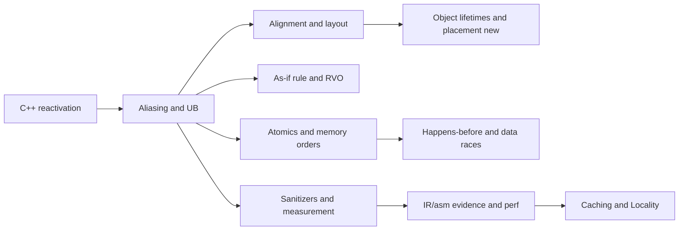

# Module 2 — Memory Model, UB, Aliasing, and Object Lifetimes

Why this matters for Lemurian Labs
- ML compiler runtimes squeeze performance from low-level details: aliasing guarantees, cache layout, and well-placed fences. You must reason precisely about when the optimizer may transform code, when UB invalidates assumptions, and how memory orders enforce visibility.
- Interview conversations will probe your ability to spot UB, reason about alignment and lifetimes, and explain why a code path is or is not safe to optimize.

Key outcomes
- Explain strict aliasing and show safe alternatives (std::bit_cast, std::memcpy, type traits).
- Diagnose alignment/padding pitfalls; define trivial/standard-layout types and why they matter for ABI and codegen.
- Distinguish const and volatile correctly; show why volatile is not a synchronization primitive.
- Explain the as-if rule, RVO/NRVO, and lifetime extension caveats (temporaries, placement new).
- Use atomics with memory orders (relaxed, acquire, release, seq_cst) to establish happens-before; demonstrate with ThreadSanitizer.
- Apply sanitizers (ASan/UBSan/TSan) and targeted flags (-fno-strict-aliasing) to surface and control hazards.
- Measure impact of aliasing and fences with microbenchmarks; prove claims with IR/asm and perf data.

Concept map


Prerequisites and environment
- Linux, clang 17+ or gcc 12+, CMake 3.24+.
- perf, valgrind (callgrind/cachegrind), Sanitizers (ASan/UBSan/TSan).
- Optional: SYCL toolchain not required here.
- Use compile_commands.json for tooling; see Module 1 setup in [C++_Lecture/01_cpp_reactivation_tooling.md](C++_Lecture/01_cpp_reactivation_tooling.md).

Reference to labs for this module
- Lab directory: [C++_Lecture/labs/m02_memory_ub/](C++_Lecture/labs/m02_memory_ub/README.md)
- CMake: [C++_Lecture/labs/m02_memory_ub/CMakeLists.txt](C++_Lecture/labs/m02_memory_ub/CMakeLists.txt)
- Aliasing microbench: [C++_Lecture/labs/m02_memory_ub/src/aliasing_bench.cpp](C++_Lecture/labs/m02_memory_ub/src/aliasing_bench.cpp)
- Atomics memory order demo: [C++_Lecture/labs/m02_memory_ub/src/atomic_order_demo.cpp](C++_Lecture/labs/m02_memory_ub/src/atomic_order_demo.cpp)

---

## Core content

1) Strict aliasing, effective types, and TBAA (what the optimizer is allowed to assume)
- What is aliasing? Two or more pointers or references that can refer to the same storage. If the compiler can prove they cannot alias, it may reorder/merge loads and stores, vectorize, and keep values in registers, all under the as-if rule.
- Effective type rule (C++ core, derived from C): An object’s stored value may only be accessed through an lvalue of:
  - its own type (including cv-qualified variants)
  - a type that is the same as the dynamic type (for polymorphic base subobjects)
  - char/unsigned char/std::byte (may alias any object’s bytes)
  - certain standard-layout common-initial-sequence cases
  Violating this is undefined behavior (UB), which removes constraints on the optimizer.
- Strict aliasing in practice: Compilers attach TBAA (Type-Based Alias Analysis) metadata to IR loads/stores. When two pointers have incompatible TBAA tags, the optimizer assumes no alias and may reorder or vectorize. See [C++_Lecture/labs/m02_memory_ub/src/aliasing_bench.cpp](C++_Lecture/labs/m02_memory_ub/src/aliasing_bench.cpp) and compare -O3 IR with and without -fno-strict-aliasing.
- Unsafe pattern (UB) example (type punning via pointer casts):
  ```cpp
  #include <cstdint>
  float f(uint32_t* pi) {
    float* pf = reinterpret_cast<float*>(pi); // UB: violates strict aliasing
    *pi = 0x3f800000u; // write via uint32_t*
    return *pf;        // read as float
  }
  ```
  Why UB? The compiler may assume a float* does not alias a uint32_t*, so the load may be hoisted or combined, returning stale data or enabling vectorization that treats them independently.
- Safe alternatives and when to use them:
  - Value re-interpretation: use std::bit_cast<T>(U) for trivially copyable types (C++20+). Example: float x = std::bit_cast<float>(0x3f800000u); The representation is copied without violating alias rules.
  - Representation-level copy: std::memcpy(&dst, &src, sizeof(dst)). Compilers often optimize small memcpy into loads/stores without aliasing UB; the standard explicitly allows reading the representation via char-like types.
  - Byte access: Access through unsigned char/char/std::byte pointers is always permitted for inspecting/modifying the object representation.
  - Union-based punning: Not portable in C++ (reading a different active member is not guaranteed). Some compilers accept it as an extension; avoid in portable code.
- Pointer provenance and lifetime: The compiler tracks which allocation an address originates from. Reinterpreting integers to pointers or writing through a pointer to an inactive object/subobject (without placement new) yields UB. When reusing storage with placement new, use std::launder when obtaining a pointer to the newly created object through an old pointer to ensure the optimizer knows the lifetime changed.
- Controlling/communicating aliasing to the optimizer:
  - Disable assumptions globally for experiments: -fno-strict-aliasing (useful to demonstrate how TBAA affects codegen in the lab).
  - Express no-alias intent locally: vendor extensions like T* __restrict p (Clang/GCC) or [[clang::restrict]]. This promises p does not alias with other relevant pointers; misuse is UB.
  - “Aliasing barriers” when micro-benchmarking: force a memory clobber (e.g., benchmark::ClobberMemory, or asm volatile("" ::: "memory")) to prevent reordering across a boundary. Note: this is a measurement tool, not a program-correctness tool.
- What to look for in LLVM IR:
  - !tbaa metadata nodes on load/store identify the type hierarchy used for alias decisions.
  - With unsafe punning, loads/stores may get different TBAA tags, letting LICM/Vectorizer assume independence.
  - With std::memcpy or std::bit_cast (for values), IR typically avoids conflicting TBAA on the same memory, keeping transformations correct.
- Tying to the lab:
  - In [aliasing_bench.cpp](C++_Lecture/labs/m02_memory_ub/src/aliasing_bench.cpp), compare BM_UnsafePunning vs BM_MemcpyWrite vs BM_BitCastWrite under:
    1) default -O3
    2) -O3 -fno-strict-aliasing
    Collect IR snippets and perf counters. Explain differences in terms of TBAA and allowed transformations.
2) Alignment, padding, and layout (how objects sit in memory and why it matters)
- Alignment fundamentals:
  - Each type T has an alignment requirement alignof(T). Objects are placed at addresses that are multiples of that alignment.
  - Over-aligned types (alignas(N) struct S {...}; N > alignof(S)) request stronger alignment. C++17 provides over-aligned allocation via ::operator new(std::size_t, std::align_val_t).
  - new T guarantees at least alignof(T). For manual buffers, use std::aligned_alloc (C23/POSIX), std::pmr::polymorphic_allocator, or C++ helpers like std::align for bump-pointer arenas.
- Performance and correctness of alignment:
  - Many ISAs allow unaligned access with penalties (x86), but some may fault or split accesses (ARM pre-v7, certain embedded). Treat unaligned loads/stores as potentially slow and hazardous.
  - std::assume_aligned<N>(p) tells the compiler p is N-aligned. Misuse is UB. Use only when you proved alignment (e.g., from allocation or protocol header guarantees).
- Padding and object representation:
  - Struct layout inserts padding between fields or at the end to satisfy alignment of members. Example:
    ```cpp
    struct A { std::uint8_t a; std::uint32_t b; };  // likely size 8 due to padding
    ```
  - Padding bytes are part of the representation but may contain indeterminate values; reading padding (e.g., via type pun or hashing raw memory) can be UB or produce unstable results across builds.
  - Avoid #pragma pack except for external wire formats; it changes ABI and often hurts performance through unaligned accesses.
- Trivial / standard-layout / trivially copyable / POD (what you can safely memcpy/memmove):
  - Trivially copyable: may be copied by memcpy/memmove; no user-provided copy/move/dtor with non-trivial semantics.
  - Trivial: default operations are trivial (e.g., trivial dtor).
  - Standard-layout: restrictions on inheritance, access control, and member order that stabilize layout and enable interop (C ABI, file/network formats).
  - “POD” (pre-C++20 term) ≈ trivial + standard-layout. Prefer precise traits: std::is_trivially_copyable_v<T>, std::is_standard_layout_v<T>, std::is_trivial_v<T>.
  - If you memcpy into/out of an object, ensure T is trivially copyable (static_assert). This is why std::bit_cast requires trivially copyable types.
- Layout control for performance and ABI:
  - Field reordering can reduce padding without changing meaning; measure cache and vectorization effects after reordering hot structs.
  - Empty Base Optimization (EBO): an empty base subobject can have zero size in the derived object. Useful in templates/CRTP to pack tag types or allocators.
  - Cache-line alignment for hot data or for false-sharing mitigation (tie-in to Module 3):
    - std::hardware_destructive_interference_size and std::hardware_constructive_interference_size give hints (~64 on many x86).
    - alignas(std::hardware_destructive_interference_size) on per-thread counters reduces false sharing (verify with perf/TSan).
- Tools and proofs:
  - Inspect offsetof and sizeof to understand layout; dump with static_assert and print. Use Compiler Explorer to visualize layout and codegen.
  - For unaligned reads of packed formats, prefer memcpy into an aligned local variable (lets the compiler generate efficient code without UB).
- Tying to the lab:
  - In [aliasing_bench.cpp](C++_Lecture/labs/m02_memory_ub/src/aliasing_bench.cpp), the memcpy/bit_cast paths are only correct because the element type is trivially copyable (float). Add static_assert(std::is_trivially_copyable_v<float>) if you generalize.
  - When experimenting with alignas on arrays or struct fields, validate with perf stat and cachegrind; avoid assuming that over-alignment always helps (it can increase footprint and hurt locality).


3) const and volatile
- const is a compile-time immutability promise; does not imply thread safety.
- volatile is for memory-mapped IO; it does not establish inter-thread ordering. Do not use volatile as a substitute for atomics.

4) As-if rule and UB
- As-if rule: compiler can transform code arbitrarily if observable behavior is unchanged. UB removes the constraint: behavior is unconstrained, enabling aggressive and surprising transforms.
- Prove claims via IR: look at TBAA metadata on loads/stores; compare unsafe aliasing vs memcpy/bit_cast variants.

5) RVO/NRVO and temporary lifetimes
- C++17 guarantees elision in certain return contexts. Understand when copies/moves disappear and how it affects lifetime and side effects.
- Lifetime hazards:
  - Returning a reference to a temporary (dangling).
  - Binding a const& to a temporary extends lifetime only to the reference, not beyond scope.
  - placement new must be paired with explicit destructor calls and correct storage management.

6) Atomics and memory orders
- std::atomic provides operations with memory orders:
  - relaxed: atomicity only, no ordering guarantees.
  - acquire/release: synchronize to create a happens-before edge.
  - seq_cst: single total order of atomic operations; strongest and slowest.
- Typical pattern: writer stores data in non-atomic, then flag.store(1, release); reader spins on flag.load(acquire) then reads data. This is correct (no data race) and visible.
- Using relaxed for the flag yields no happens-before; the read of data is a data race (TSan will report).

---

## From Rust to C++ bridges

- Borrowing vs aliasing
  - Rust enforces aliasing at compile time; C++ assumes you uphold aliasing rules manually. Violations are UB and can miscompile silently.
  - Rust’s &mut T exclusive borrow ≈ C++’s non-const pointer/reference with the implicit contract of no alias; C++ compilers cannot enforce it.

- Lifetimes vs RAII
  - Rust lifetimes statically ensure no dangling references; C++ uses RAII, but references/pointers can dangle at runtime—your responsibility to avoid.
  - placement new has no Rust equivalent in safe code; think of it like constructing in pre-allocated storage with explicit lifetime control.

- volatile vs atomics
  - Rust’s atomic Ordering mirrors C++ memory_order; both require discipline. Volatile in both ecosystems is not a concurrency primitive.

- Unsafe vs UB
  - Rust unsafe is a capability to perform operations the compiler cannot verify; it doesn’t mean UB but requires upholding invariants.
  - C++ allows many unsafe operations by default; violating invariants is UB with no diagnostics guaranteed.

---

## Hands-on Lab A — Aliasing and Type-Punning Microbench

Goal
- Demonstrate strict aliasing constraints and compare unsafe reinterpret_cast writes against safe std::bit_cast/memcpy approaches.
- Compare performance and examine IR/TBAA metadata; show how -fno-strict-aliasing changes codegen and sometimes correctness.

Files
- CMake: [C++_Lecture/labs/m02_memory_ub/CMakeLists.txt](C++_Lecture/labs/m02_memory_ub/CMakeLists.txt)
- Source: [C++_Lecture/labs/m02_memory_ub/src/aliasing_bench.cpp](C++_Lecture/labs/m02_memory_ub/src/aliasing_bench.cpp)
- README: [C++_Lecture/labs/m02_memory_ub/README.md](C++_Lecture/labs/m02_memory_ub/README.md)

Build and run
```bash
# Configure and export compile_commands.json for tooling
cmake -S C++_Lecture/labs/m02_memory_ub -B build/m02 \
  -DCMAKE_BUILD_TYPE=Release -DCMAKE_CXX_COMPILER=clang++ \
  -DBENCHMARK_ENABLE_TESTING=OFF -DCMAKE_EXPORT_COMPILE_COMMANDS=ON
cmake --build build/m02 -j

# Compare strict vs no-strict aliasing executables
taskset -c 2 ./build/m02/aliasing_bench_strict
taskset -c 2 ./build/m02/aliasing_bench_nostrict
```

Measurement and evidence
- perf: taskset -c 2 perf stat -d -r 5 ./build/m02/aliasing_bench_strict
- IR: clang++ -O3 -S -emit-llvm -std=c++23 -I<benchmark-includes> C++_Lecture/labs/m02_memory_ub/src/aliasing_bench.cpp -o /tmp/alias.ll
  - Inspect !tbaa on loads/stores; compare unsafe vs memcpy/bit_cast paths.
- callgrind: valgrind --tool=callgrind ./build/m02/aliasing_bench_strict

Notes
- The unsafe path is UB; the purpose is educational. Do not ship code relying on it. Some platforms may produce “correct-looking” results; IR metadata and compiler reasoning are still instructive.

---

## Hands-on Lab B — Atomic Memory Order Playground with TSan

Goal
- Show why relaxed does not synchronize and how acquire/release creates a happens-before that fixes a data race. Use ThreadSanitizer to demonstrate the difference.

Files
- Source: [C++_Lecture/labs/m02_memory_ub/src/atomic_order_demo.cpp](C++_Lecture/labs/m02_memory_ub/src/atomic_order_demo.cpp)
- README: [C++_Lecture/labs/m02_memory_ub/README.md](C++_Lecture/labs/m02_memory_ub/README.md)

Build and run (TSan)
```bash
# Two TSan variants built via CMake targets
./build/m02/atomic_relaxed_tsan   # expect TSan data race report
./build/m02/atomic_acqrel_tsan    # race fixed; no TSan report
```

Optional perf probe
- Spin loads benchmark (acquire vs relaxed) can be added; in this lab focus on correctness and happens-before proof with TSan.

---

## Microbench and profiling checklist (Module 2 focus)

- Flags and toggles
  - -O0 vs -O3 to expose optimizer effects
  - -march=native for local performance; document ISA
  - -fno-strict-aliasing to disable TBAA assumptions (diagnostic experiments)
  - Sanitizers:
    - -fsanitize=address,undefined (Lab A safe-path validation)
    - -fsanitize=thread (Lab B to expose the race under relaxed)

- Keep the optimizer honest
  - Use benchmark::DoNotOptimize and benchmark::ClobberMemory in microbenchmarks.
  - Provide noinline on helpers when isolating effects.

- Evidence bundle
  - Numbers (ns/op), counters (IPC, LLC misses), IR snippets with TBAA, and clear narrative linking aliasing constraints to codegen differences.

---

## Tooling track

- Static analysis
  - clang-tidy checks: bugprone-*, performance-*, cppcoreguidelines-*, modernize-* focusing on ownership and aliasing pitfalls.
- Formatting and includes
  - clang-format to normalize diffs; include-what-you-use to ensure headers match actual usage.
- Compiler Explorer
  - Compare unsafe aliasing vs std::bit_cast on -O3; inspect TBAA and vectorization decisions.

---

## Interview drills

Code reading 1 — Spot the UB
```cpp
#include <cstdint>
float f(uint32_t* pi) {
  float* pf = reinterpret_cast<float*>(pi); // UB: violate strict aliasing
  *pi = 0x3f800000u; // 1.0f in IEEE-754 written through int*
  return *pf;        // read as float
}
```
Prompts
- Why is this UB even if it “works”? Provide two safe rewrites.

Code reading 2 — Volatile versus atomic
```cpp
#include <atomic>
volatile int flag_v = 0;
int data = 0;
void writer() { data = 42; flag_v = 1; }   // not synchronized
void reader() { while(flag_v == 0){} (void)data; }
```
Prompts
- Explain why volatile fails to synchronize. Provide a correct atomic variant and memory orders.

Memory order rewrite
- Given a relaxed flag loop that reads non-atomic data, rewrite using release-store and acquire-load on a std::atomic<int> flag and justify correctness.

Whiteboard snippet (≤15 lines)
- Implement a function that constructs N objects into a pre-allocated buffer using placement new and then destroys them. State lifetime rules and when destructors must be called.

“Will this be optimized away and why?”
- Example: if the compiler believes pointers don’t alias, it may reorder loads/stores. Explain how -fno-strict-aliasing changes the optimizer’s assumptions.

---

## Assessment

Short answer (10)
1) Define strict aliasing and list the standard exceptions.
2) Why are char/unsigned char allowed to alias any object type?
3) What is TBAA metadata in LLVM IR used for?
4) Distinguish trivial, standard-layout, and POD types. Why do we care?
5) Why is volatile not a concurrency primitive?
6) Explain the as-if rule and how UB affects it.
7) When does C++17 guarantee copy elision? Why does it matter for lifetimes?
8) What is placement new and when must you call a destructor manually?
9) Describe memory_order_relaxed vs memory_order_acquire vs memory_order_release.
10) How does ThreadSanitizer decide whether two accesses constitute a data race?

Explain to a peer
- Teach a colleague why reinterpret_cast-based type punning can miscompile and how std::bit_cast preserves semantics while enabling optimization. Use a 2-minute IR-based demonstration.

---

## Assets

Cheat-sheet bullets
- Use std::bit_cast or memcpy; avoid pointer-type punning that violates strict aliasing.
- char/unsigned char/std::byte may alias any object; otherwise assume no alias.
- volatile is for IO, not inter-thread ordering; use std::atomic with acquire/release.
- As-if rule: optimizer can transform code unless observable behavior changes; UB removes constraints.
- placement new requires explicit destructor and careful lifetime management.
- Establish happens-before with release-store and acquire-load; relaxed provides no ordering.

Glossary delta (Rust → C++)
- aliasing rules enforced by borrow checker → manual discipline; UB if violated
- lifetime parameter → implicit RAII and programmer reasoning; dangling is possible
- Ordering in std::sync::atomic → std::memory_order acquire/release/seq_cst
- noalias LLVM attribute in Rust → compilers may assume restrict-like properties in C++ under strict aliasing

5-minute spaced repetition set
- Q: What is strict aliasing? A: Assumption that pointers to different unrelated types do not alias; violating it is UB.
- Q: When is char allowed to alias? A: Always; char/unsigned char/std::byte may inspect any object’s representation.
- Q: Why is volatile not for concurrency? A: It prevents some optimizations around the volatile object but does not establish happens-before.
- Q: What creates happens-before with atomics? A: A release operation synchronizes-with a matching acquire on the same atomic, ordering previous writes.
- Q: What’s the safe alternative to reinterpret_cast-based punning? A: std::bit_cast or memcpy.
- Q: When is copy elision guaranteed? A: C++17 in certain return/initialization contexts for prvalues (materialization in caller).
- Q: What does -fno-strict-aliasing do? A: Disables aliasing assumptions; may reduce optimization but avoids miscompiles when code violates aliasing.
- Q: How to spot aliasing assumptions in IR? A: Look for !tbaa tags on loads/stores; compare across variants.

---

## Deliverables for Module 2
- Aliasing microbench numbers and IR snippets illustrating TBAA differences between unsafe and safe code.
- TSan run logs showing a data race under relaxed mode and no race under acquire/release.
- Short write-up explaining how these constraints inform kernel and allocator design.

Next module
- Caching, Locality & Core Allocation: apply these guarantees to improve memory access patterns and eliminate false sharing.