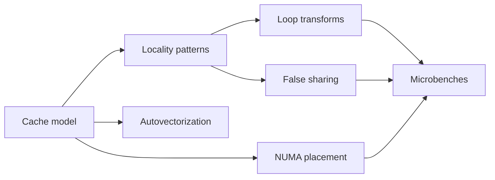

# Module 3 — Caching, Locality, and Core Allocation

Why this matters for Lemurian Labs
- ML kernels are dominated by memory behavior. Cache lines, associativity, and access order often determine performance more than instruction count.
- Compiler transformations (vectorization, loop interchange, tiling) only help when the data layout and aliasing contracts allow them. Engineers must reason from memory to codegen to counters.
- Runtime schedulers and core pinning decide whether your carefully optimized loop competes with noisy neighbors. NUMA and first-touch policies matter for model sharding and pipeline stages.

Key outcomes
- Explain cache lines, associativity, miss types, prefetching, TLB, and branch prediction in practical terms; connect to perf metrics.
- Improve locality via AoS vs SoA, loop interchange, blocking tiling, and alignment; validate with perf and cachegrind.
- Detect and remove false sharing; use padding and per-thread sharding; quantify with perf and TSan.
- Understand NUMA basics, first-touch allocation, core pinning, and when to use taskset and numactl.
- Read compiler vectorization diagnostics and influence codegen with flags and alignment hints; know restrict analogs and aliasing barriers.

Concept map


Prerequisites and environment
- Linux, clang 17+ or gcc 12+, CMake 3.24+, perf, valgrind (cachegrind, callgrind).
- Optional: numactl, lscpu for topology, likwid-topology if available.
- Build artifacts for this module live in [C++_Lecture/labs/m03_locality/](C++_Lecture/labs/m03_locality/README.md).

Reference to labs for this module
- Lab directory: [C++_Lecture/labs/m03_locality/](C++_Lecture/labs/m03_locality/README.md)
- CMake: [C++_Lecture/labs/m03_locality/CMakeLists.txt](C++_Lecture/labs/m03_locality/CMakeLists.txt)
- AoS vs SoA microbench: [C++_Lecture/labs/m03_locality/src/aos_soa_bench.cpp](C++_Lecture/labs/m03_locality/src/aos_soa_bench.cpp)
- False sharing and padding: [C++_Lecture/labs/m03_locality/src/false_sharing_bench.cpp](C++_Lecture/labs/m03_locality/src/false_sharing_bench.cpp)

---

## Core content

1) Cache hierarchy, associativity, and miss types
- Lines and sets
  - Data moves in cache line granularity (commonly 64 B on x86). Caches are set-associative: each address maps to a set; within a set there are a fixed number of ways (e.g., 8-way).
  - Conflict misses occur when multiple hot addresses map to the same set and exceed its ways; capacity misses when the working set exceeds the total capacity; compulsory misses on first touch.
- Replacement and prefetching
  - Replacement policies are pseudo-LRU variants. Streaming patterns can evict useful data; blocking can reduce this.
  - Prefetchers detect strides and bring lines early; irregular strides thwart them. Software prefetch (__builtin_prefetch) can help when you know future accesses and latency to overlap; measure carefully.
- TLB and page size
  - The Translation Lookaside Buffer caches virtual to physical translations. Stride-based scans may thrash the TLB; huge pages reduce TLB pressure at cost of fragmentation.
- Branch prediction and control flow
  - Mispredicts cost tens of cycles; convert unpredictable branches to arithmetic or predication when profitable. Loop layout and data layout both influence predictability.
- Perf mapping
  - perf stat -d shows LLC-load-misses, dTLB-load-misses, branch-misses. Use these to reason if you are bandwidth bound, latency bound, or control-flow bound.

2) Locality patterns and data layout transformations
- Temporal vs spatial locality
  - Temporal: reuse the same data soon; spatial: use neighbors within the same line. Aim to keep reuses within L1 or L2 windows.
- AoS vs SoA
  - Array of Structures (AoS) stores x,y,z together; good when loops touch all fields per element. Structure of Arrays (SoA) stores separate arrays per field; better for vectorized operations over a single field.
  - Mixed patterns (AoSoA or SoAoS) tile fields within cache-friendly blocks to combine benefits.
- Loop transforms
  - Interchange to make the innermost loop stride-1. Block tile loops to fit working sets into L1 or L2; choose block sizes empirically.
  - Unroll and jam to increase ILP and help vectorizers; beware register pressure and code size.
- Alignment and vectorization
  - Align arrays to 32 B or 64 B boundaries for AVX2 AVX512 loads. Tell the compiler using std::assume_aligned when provable; misuse is UB.
  - Confirm vectorization: clang -Rpass=loop-vectorize or gcc -fopt-info-vec shows which loops vectorized and why not.
- Roofline intuition
  - Arithmetic intensity = flops per byte moved. If you are below machine balance, you are bandwidth-bound; tiling and layout can increase reuse and intensity.

3) NUMA basics and core allocation
- Sockets and memory controllers
  - Multi-socket systems have separate memory controllers; remote memory access has higher latency and lower bandwidth.
- First-touch and policies
  - Most Linux distros use first-touch allocation: the core that first writes to a page places it in its local NUMA node. Parallel initialization should mirror future access patterns to avoid remote hits.
- Pinning and placement
  - Pin threads with taskset or sched_setaffinity to stabilize measurements. Use numactl --cpunodebind --membind to control placement. Beware migrating threads under load.
- When to care
  - Once single-thread is tuned, measure multi-thread scaling. If scaling flattens early, check remote memory traffic and false sharing.

4) False sharing, padding, and contention
- What is false sharing
  - Two threads update different variables residing in the same cache line. Coherence invalidations bounce the line, throttling throughput.
- Diagnosing and fixing
  - Symptoms: high LLC-store-misses, store buffer stalls, and perf scaling collapse. Fix by padding per-thread data to cache line size (alignas(std::hardware_destructive_interference_size) or alignas(64)).
  - Shard data structures per thread and combine with a reduction pass. Prefer write-combining patterns over frequent cross-thread updates.
- Atomics and contended counters
  - Even with padding, atomics serialize when many threads hit the same cache line. Aggregate locally and reduce infrequently.

5) Autovectorization, aliasing constraints, and restrict analogs
- Preconditions for vectorization
  - Uniform loop trip count, stride-1 memory, no loop-carried dependencies, and no aliasing among pointers used in the loop.
- Communicating to the compiler
  - Avoid hidden aliasing between input and output arrays; pass distinct pointers or use restrict-like qualifiers (GCC/Clang __restrict). Document and uphold this contract; misuse is UB.
  - Provide alignment facts (std::assume_aligned) and constant strides. Consider constexpr block sizes and unrolling hints.
- Flags and reports
  - -O3 -march=native unlocks ISA. Inspect reports with clang -Rpass=loop-vectorize -Rpass-missed=loop-vectorize and GCC -fopt-info-vec-optimized.

6) Measurement discipline for locality work
- Stabilize
  - Warm caches; disable turbo when appropriate; pin to cores; isolate CPUs via taskset.
- Counters
  - perf stat -d -r 5 to collect IPC, cache and TLB misses; perf record -g for call stacks; cachegrind for synthetic cache hit modeling.
- Keep the optimizer honest
  - Prevent DCE with benchmark::DoNotOptimize and benchmark::ClobberMemory; compare -O0 vs -O3; selectively use -fno-inline when studying inlining effects.

---

## From Rust to C++ bridges

- Slices vs spans
  - Rust slices &[T] carry length and borrow semantics preventing aliasing errors; C++ std::span is a non-owning view with no aliasing guarantees. You must ensure lifetimes and non-overlap manually or via API contracts.
- Iterators and pipelines
  - Rust iterators compose lazily; C++ ranges can, too. For hot loops, prefer explicit loops when optimization requires predictable memory walks. Validate vectorization.
- Send Sync vs C++ threading
  - Rust types opt into cross-thread sharing via Send Sync. C++ shares by default; you must avoid false sharing and data races proactively.
- #[repr(C)] vs standard-layout
  - Rust repr(C) for ABI stability maps to C++ standard-layout; use it for interop or stable binary layouts.

---

## Hands-on Lab A — AoS vs SoA sweep with blocking

Goal
- Compare AoS and SoA for a simple stencil and reduction over struct fields. Explore block sizes for L1 and L2. Confirm vectorization and measure miss behavior.

Files
- CMake: [C++_Lecture/labs/m03_locality/CMakeLists.txt](C++_Lecture/labs/m03_locality/CMakeLists.txt)
- Source: [C++_Lecture/labs/m03_locality/src/aos_soa_bench.cpp](C++_Lecture/labs/m03_locality/src/aos_soa_bench.cpp)
- README: [C++_Lecture/labs/m03_locality/README.md](C++_Lecture/labs/m03_locality/README.md)

Build and run
```bash
cmake -S C++_Lecture/labs/m03_locality -B build/m03 \
  -DCMAKE_BUILD_TYPE=Release -DCMAKE_CXX_COMPILER=clang++ \
  -DBENCHMARK_ENABLE_TESTING=OFF -DCMAKE_EXPORT_COMPILE_COMMANDS=ON
cmake --build build/m03 -j

taskset -c 2 ./build/m03/aos_soa_bench --benchmark_min_time=2.0
```

Evidence
- perf: taskset -c 2 perf stat -d -r 5 ./build/m03/aos_soa_bench
- cachegrind: valgrind --tool=cachegrind ./build/m03/aos_soa_bench
- Vectorization reports: compare -Rpass=loop-vectorize vs disable vectorization to confirm deltas.

---

## Hands-on Lab B — False sharing demonstration and mitigation

Goal
- Demonstrate throughput collapse when per-thread counters share a line. Fix with padding and alignas. Quantify scaling across threads.

Files
- Source: [C++_Lecture/labs/m03_locality/src/false_sharing_bench.cpp](C++_Lecture/labs/m03_locality/src/false_sharing_bench.cpp)
- README: [C++_Lecture/labs/m03_locality/README.md](C++_Lecture/labs/m03_locality/README.md)

Run
```bash
# Compare shared vs padded with 2, 4, 8 threads
taskset -c 2-9 ./build/m03/false_sharing_bench --benchmark_min_time=2.0 --benchmark_counters_tabular=true
```

---

## Microbench and profiling checklist (Module 3 focus)

- Flags
  - -O3 -march=native, plus -fno-tree-vectorize or -Rpass-missed toggles for experiments. Consider -fno-inline to inspect function boundaries.
- Pinning and NUMA
  - taskset to pin; numactl --localalloc or --membind to control memory placement; confirm with numastat.
- Counters to watch
  - cache-misses, cache-references, LLC-load-misses, dTLB-load-misses, branch-misses, cycles, instructions, stalled-cycles-frontend and backend if available.
- Evidence bundle
  - ns/op, IPC, cache miss deltas, IR vectorization hints, and block size table with best L1/L2 choices.

---

## Tooling track

- clang-tidy checks
  - performance-*, readability-identifier-naming, bugprone-sizeof-expression, cppcoreguidelines-pro-type-reinterpret-cast (guard against unsafe punning in vectorized code).
- Compiler Explorer
  - Inspect the inner loops for aligned vector loads and gather scatter fallback. Check if aliasing assumptions prevent vectorization.

---

## Interview drills

Code reading 1 — AoS vs SoA
```cpp
struct P { float x, y, z, w; };
void saxpy_aos(P* p, const float* a, const float* b, int n) {
  for (int i = 0; i < n; ++i) {
    p[i].x = a[i] * 2.0f + b[i];
  }
}
void saxpy_soa(float* x, const float* a, const float* b, int n) {
  for (int i = 0; i < n; ++i) {
    x[i] = a[i] * 2.0f + b[i];
  }
}
```
Prompts
- Which is easier to vectorize and why? How would you restructure AoS to help (AoSoA)?
- What perf counters would you expect to change between the two?

Code reading 2 — False sharing
```cpp
struct Counters {
  long c0, c1, c2, c3;
};
```
Prompts
- Why might threads incrementing c0 and c1 thrash? Show a portable fix.

Rewrite drill
- Given a triple-nested loop over a matrix, choose tile sizes Tm, Tn to fit in L1 and rewrite the nest. Show perf numbers before after and a brief roofline argument.

Whiteboard snippet (≤15 lines)
- Implement a parallel reduction over an array with per-thread shards and a final combine step. Note how you avoid false sharing and how you choose the shard size.

“Will this be optimized away and why”
- If two pointers may alias, the compiler cannot vectorize safely. Show how you would prove non-aliasing in the function interface or at the call sites.

---

## Assessment

Short answer (10)
1) Define cache line, associativity, and the three classic miss types.
2) Explain how stride affects prefetchers and vector loads.
3) Describe AoS vs SoA vs AoSoA and when each is beneficial.
4) How does loop interchange improve locality? Give an example.
5) What is false sharing and how do you eliminate it?
6) What is first-touch allocation and why does it matter on NUMA machines?
7) How do you communicate non-aliasing to the compiler in portable and non-portable ways?
8) Name two compiler flags that help you inspect vectorization decisions.
9) How does alignment impact vectorization and when is std::assume_aligned safe?
10) Which perf counters indicate TLB pressure and what mitigations exist?

Explain to a peer
- Teach a teammate why data layout changes can dominate performance over algorithmic differences for memory-bound kernels, using an AoS to SoA rewrite and a block size sweep as the concrete example.

---

## Assets

Cheat-sheet bullets
- Innermost loop should be stride-1 over the hottest array; block to fit L1/L2.
- SoA often beats AoS for per-field vectorized ops; AoSoA balances cache and API ergonomics.
- Align hot arrays; communicate non-aliasing and alignment only when true.
- Pin threads; first-touch memory where it will be used; avoid false sharing with alignas and sharding.
- Validate with perf and cachegrind; trust measurements over intuition.

Glossary delta
- cache line: smallest unit moved between memory hierarchy levels
- set associativity: number of lines per set that can hold addresses mapping to that set
- AoS SoA: data layout choices with different vectorization and locality characteristics
- first-touch: policy that assigns a page to the NUMA node of the core that first writes it
- false sharing: coherence traffic due to independent variables sharing a line

Five-minute spaced repetition set
- Q: What are the three cache miss types? A: Compulsory, capacity, conflict.
- Q: Why does SoA help vectorization? A: Contiguous, stride-1 per field; reduces gather scatter and improves prefetch accuracy.
- Q: How do you avoid false sharing? A: Pad per-thread data to cache line size and reduce infrequently.
- Q: When is std::assume_aligned safe? A: Only when you can prove the pointer meets the stated alignment.
- Q: What counters suggest TLB issues? A: dTLB-load-misses high; mitigate via blocking, huge pages, or better access patterns.

---

## Deliverables for Module 3
- AoS vs SoA benchmark results with a table of block sizes and best-performing configuration, plus vectorization report snippets.
- False sharing benchmark scaling chart across threads before and after padding.
- Short write-up linking counters to hypotheses and code changes.

Next module
- Templates, constexpr, and concepts for performance: expressing specialization and dispatch to unlock compile-time optimizations.