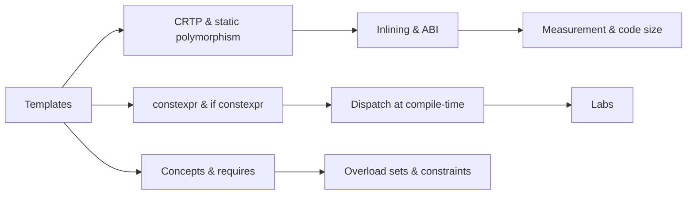

# Module 4 — Templates, Constexpr, Concepts, and Metaprogramming for Performance

Why this matters for Lemurian Labs
- ML runtimes benefit from compile-time specialization: unrolled tiles, statically chosen kernels, and zero-overhead abstractions. Template-based static polymorphism and constexpr let you eliminate runtime branches and virtual indirections.
- Concepts and requires-expressions encode invariants in the type system, improving error messages and enabling targeted overloads without brittle SFINAE.
- Understanding ABI/inlining and monomorphization tradeoffs is critical to keep build size and compile time in check while achieving peak codegen.

Key outcomes
- Use concepts and requires to constrain templates, replacing many SFINAE patterns with clearer code.
- Apply CRTP for static polymorphism; compare against virtual dispatch in hot loops, measure call overhead and inlining/code size effects.
- Write constexpr and if constexpr code paths; use compile-time dispatch to select tile sizes and kernels; understand EBO and ABI implications.
- Inspect vectorization and inlining with reports; use -ftime-trace, nm, size, and objdump to reason about binary impact.
- Understand variant/optional costs and when std::visit pays for itself vs templates or function pointers.

Concept map


Prerequisites and environment
- Linux, clang 17+ or gcc 12+, CMake 3.24+.
- perf, valgrind (callgrind), Compiler Explorer for IR/asm deltas; nm, objdump, size for binary analysis.
- Lab directory: [C++_Lecture/labs/m04_metaprogramming/](C++_Lecture/labs/m04_metaprogramming/README.md)

Reference to labs for this module
- CMake: [C++_Lecture/labs/m04_metaprogramming/CMakeLists.txt](C++_Lecture/labs/m04_metaprogramming/CMakeLists.txt)
- CRTP vs virtual microbench: [C++_Lecture/labs/m04_metaprogramming/src/crtp_vs_virtual_bench.cpp](C++_Lecture/labs/m04_metaprogramming/src/crtp_vs_virtual_bench.cpp)
- Concept- and constexpr-based dispatch: [C++_Lecture/labs/m04_metaprogramming/src/concept_dispatch_bench.cpp](C++_Lecture/labs/m04_metaprogramming/src/concept_dispatch_bench.cpp)

---

## Core content

1) Concepts and requires (constraints over ad-hoc SFINAE)
- Motivation
  - Pre-C++20, enable_if and substitution failure (SFINAE) produced obscure diagnostics and brittle overload sets.
  - Concepts provide named predicates evaluated during template argument substitution; failures are clean, and overload resolution respects partial ordering with constraints.
- Defining concepts
  - Simple form: 
    ```cpp
    template<class T>
    concept Floating = std::is_floating_point_v<T>;
    ```
  - Requires-expressions validate syntax and semantics:
    ```cpp
    template<class T>
    concept HasMulAdd = requires(T a, T b, T c) {
      { a * b + c } -> std::same_as<T>;
    };
    ```
- Constraining templates
  - Constrain the template or individual functions:
    ```cpp
    template<Floating T> T axpy(T a, T x, T y);
    template<class T> requires Floating<T> T axpy(T a, T x, T y);
    ```
  - Abbreviated function templates: 
    ```cpp
    auto axpy(Floating auto a, Floating auto x, Floating auto y) { return a*x + y; }
    ```
- Constraint normalization and short-circuiting
  - Conjunctions and disjunctions are normalized; failed constraints don’t instantiate the body. Combine semantic (requires) and trait-based checks.
- Why this matters for performance
  - Clear constraints enable specialized kernels for types meeting specific properties (e.g., trivially copyable, vectorizable). It also reduces template bloat by focusing instantiations.

2) CRTP and static polymorphism (eliminate virtual overhead in hot paths)
- Virtual dispatch vs static dispatch
  - Virtual calls go through an indirection (vptr), inhibiting inlining and vectorization unless devirtualized. In tight loops, this often dominates cost.
  - CRTP expresses the “interface” via templates:
    ```cpp
    template<class Derived>
    struct OpBase {
      float apply(float x) const {
        return static_cast<const Derived*>(this)->apply_impl(x);
      }
    };
    struct MulAdd : OpBase<MulAdd> {
      float a, b;
      float apply_impl(float x) const { return a * x + b; }
    };
    ```
  - Calls are statically bound, unlock inlining and loop vectorization.
- Empty Base Optimization (EBO)
  - Empty base subobjects can have zero size; CRTP and policy-based designs exploit this to keep objects compact.
- ABI and costs
  - Templates monomorphize per type combination, increasing code size (“code bloat”). Use link-time dead-stripping and measure with size and nm, check hot functions only once inlined into callers.

3) constexpr and consteval (compile-time computation and control flow)
- constexpr functions can run at compile-time if arguments are constant and semantics permitted:
  ```cpp
  constexpr int pow2(int n) { return 1 << n; }
  static_assert(pow2(5) == 32);
  ```
- if constexpr selects branches at compile-time; dead branches are not instantiated:
  ```cpp
  template<class T>
  auto norm2(T x, T y) {
    if constexpr (std::is_integral_v<T>) { /* integer path */ }
    else { /* floating path */ }
  }
  ```
- consteval forces compile-time evaluation; use sparingly for meta computations.
- Performance principle: constexpr and if constexpr eliminate runtime branching and allow the optimizer to see constants (enabling unrolling, vectorization, better register allocation).

4) Compile-time dispatch patterns (tiles, policies, and overload sets)
- Tag dispatch via types (std::integral_constant) and switch-over-tiles with template instantiations:
  - Small set of favored tile sizes templatized; runtime size maps to nearest specialization via switch. This yields specialized code without runtime overhead on hot loops.
- Policies and traits
  - Use traits to select implementations (e.g., HasFMA selects fused multiply-add variant). Policy classes keep cross-cutting concerns orthogonal.
- Ranges and iterators
  - Concepts over ranges/contiguous ranges let you write generic kernels that still vectorize when constraints convey stride-1 and no alias.

5) Variant/optional and inlining
- std::variant enables type-safe unions, dispatched via std::visit, but often adds a runtime branch per visit.
- Guidelines:
  - For tight kernels: prefer static alternatives (CRTP/templates); variant is acceptable at boundaries and when dispatch frequency is low relative to work per visit.
  - Prove with benchmarks and -O3 IR: inlining across visit is possible only for compile-time known alternatives.

6) Measuring effects and keeping code size under control
- Use:
  - -ftime-trace (Clang) to analyze template compile time hot spots (view in Chrome).
  - nm, size, objdump -d to inspect symbol bloat and inlining.
  - perf and callgrind to verify runtime improvements outweigh code size.
- Build hygiene:
  - Limit exposed templates in headers; PIMPL or non-template facades at boundaries reduce rebuild scope.
  - Prefer explicit instantiations for commonly used types to control where code is emitted.

---

## From Rust to C++ bridges

- Traits vs Concepts
  - Rust traits and where-bounds ≈ C++ concepts and requires; both shape overload sets and monomorphization. Rust’s coherence rules don’t exist in C++; be careful with ADL and overload resolution.
- Monomorphization and code bloat
  - Rust and C++ both monomorphize generics/templates; both can inflate binaries. Control specialization counts and prefer small type sets for hot kernels.
- Zero-cost abstractions
  - Rust iterators often compile down to loops; C++ ranges can too if constexpr and concepts expose constant strides and no-alias assumptions. Validate with Compiler Explorer.
- Dynamic dispatch
  - Rust dyn Trait ≈ C++ virtual; both introduce indirection. For kernels, prefer static dispatch and keep dynamic polymorphism at edges.

---

## Hands-on Lab A — CRTP vs Virtual: call overhead, inlining, code size

Goal
- Compare virtual dispatch to CRTP/static dispatch for a simple kernel (axpy-like). Measure ns/op, IPC, and verify inlining/code size differences with nm/size/objdump.

Files
- CMake: [C++_Lecture/labs/m04_metaprogramming/CMakeLists.txt](C++_Lecture/labs/m04_metaprogramming/CMakeLists.txt)
- Source: [C++_Lecture/labs/m04_metaprogramming/src/crtp_vs_virtual_bench.cpp](C++_Lecture/labs/m04_metaprogramming/src/crtp_vs_virtual_bench.cpp)
- README: [C++_Lecture/labs/m04_metaprogramming/README.md](C++_Lecture/labs/m04_metaprogramming/README.md)

Procedure
```bash
cmake -S C++_Lecture/labs/m04_metaprogramming -B build/m04 \
  -DCMAKE_BUILD_TYPE=Release -DCMAKE_CXX_COMPILER=clang++ \
  -DBENCHMARK_ENABLE_TESTING=OFF -DCMAKE_EXPORT_COMPILE_COMMANDS=ON
cmake --build build/m04 -j

# Run
taskset -c 2 ./build/m04/crtp_vs_virtual_bench
taskset -c 2 perf stat -d -r 5 ./build/m04/crtp_vs_virtual_bench

# Inspect binary/code size
size ./build/m04/crtp_vs_virtual_bench
nm -C --size-sort ./build/m04/crtp_vs_virtual_bench | tail -40
objdump -d ./build/m04/crtp_vs_virtual_bench | less
```

What to record
- ns/op and IPC for virtual vs CRTP; show inlining evidence (absence of callq in CRTP hot loops).
- Code size delta and function symbol list; confirm single specialized hot loop.

---

## Hands-on Lab B — Concepts + constexpr dispatch vs runtime dispatch

Goal
- Compare compile-time kernel selection (concepts, if constexpr, template TILE) against a runtime strategy (function pointer or variant visitation). Demonstrate ns/op improvement and vectorization stability.

Files
- Source: [C++_Lecture/labs/m04_metaprogramming/src/concept_dispatch_bench.cpp](C++_Lecture/labs/m04_metaprogramming/src/concept_dispatch_bench.cpp)
- README: [C++_Lecture/labs/m04_metaprogramming/README.md](C++_Lecture/labs/m04_metaprogramming/README.md)

Procedure
```bash
taskset -c 2 ./build/m04/concept_dispatch_bench
taskset -c 2 perf stat -d -r 5 ./build/m04/concept_dispatch_bench
```

Evidence
- Show the switch-over-tiles (e.g., 8, 16, 32) mapping to template instantiations. Confirm vectorization in IR/asm. Compare to runtime loop with generic tile size.

---

## Microbench and profiling checklist (Module 4 focus)

- Flags
  - -O3 -march=native, optionally -fno-plt on some distros; add -fno-exceptions/-fno-rtti experiments (note: affects virtual path semantics).
  - For analysis: -Rpass=inline -Rpass-missed=inline (Clang), -ftime-trace.
- Tools
  - nm, size, objdump, perf stat/record; callgrind for instruction accounting.
- Hygiene
  - Keep optimizer honest with benchmark::DoNotOptimize/ClobberMemory; compare inlining on/off variants if included.

---

## Tooling track

- clang-tidy checks
  - performance-*, readability-*, modernize-use-using, modernize-use-constexpr, bugprone-use-after-move (for CRTP and forwarding).
- Compiler Explorer
  - Confirm hot loop in CRTP is fully inlined; verify if constexpr prunes branches; inspect vector length and memory ops.

---

## Interview drills

Code reading 1 — Virtual vs static
```cpp
struct Op { virtual float apply(float) const = 0; virtual ~Op() = default; };
struct MulAdd : Op { float a,b; float apply(float x) const override { return a*x+b; } };

template<class D>
struct OpC { float apply(float x) const { return static_cast<const D*>(this)->impl(x); } };
struct MulAddC : OpC<MulAddC> { float a,b; float impl(float x) const { return a*x+b; } };
```
Prompts
- Which will inline in a tight loop and why? How to prove via asm? When might the compiler devirtualize the virtual call?

Code reading 2 — Concepts and overload sets
```cpp
template<class T>
concept Floating = std::is_floating_point_v<T>;

template<Floating T>
T axpy(T a, T x, T y);

template<class T>
T axpy(T a, T x, T y); // which resolves when T=int?
```
Prompts
- Explain overload resolution when T=int and T=float. How would SFINAE behave differently?

Rewrite drill
- Replace a runtime if (tile==8) ... else if (tile==16) ... with a compile-time switch over template<int TILE> specializations. Provide a small dispatch wrapper that falls back to a generic loop for uncommon tiles.

Whiteboard snippet (≤15 lines)
- Implement a constexpr function choose_tile(N) that returns 8, 16, or 32 based on N and a max register budget, and use it in if constexpr to select the kernel.

“Will this be optimized away and why?”
- If constexpr branches with false condition vanish at compile time; demonstrate with an example where the generic path contains a bounds check that disappears in the specialized instantiation.

---

## Assessment

Short answer (10)
1) Contrast concepts/constraints with SFINAE in readability and error messages.
2) Define CRTP and give one advantage and one drawback.
3) When does virtual dispatch meaningfully harm hot-loop performance? How can devirtualization occur?
4) Give an example where if constexpr enables vectorization that a runtime if would block.
5) What is EBO and why does it matter for policy types?
6) How do you detect code bloat? Name two CLI tools for inspection.
7) When do variant/std::visit overheads matter in kernels?
8) How can concepts reduce template bloat?
9) What inline reports/flags can you use to check inlining decisions?
10) Why might -fno-exceptions and -fno-rtti be considered for high-performance builds? What are the tradeoffs?

Explain to a peer
- Teach a teammate how compile-time tile selection removes branches and improves vectorization, using a small axpy kernel as the example and showing asm for one tile.

---

## Assets

Cheat-sheet bullets
- Prefer concepts over SFINAE for clarity and targeted overloads.
- CRTP → static dispatch → inlining; keep dynamic dispatch at boundaries.
- if constexpr eliminates dead branches; constexpr values propagate constants for better codegen.
- Specialize for a small set of tiles via templates; fall back to generic loop for outliers.
- Monitor code size (nm/size) and compile time (-ftime-trace); limit instantiation sets.

Glossary delta
- CRTP: Curiously Recurring Template Pattern; static polymorphism idiom.
- concept: compile-time predicate constraining templates.
- consteval: must-evaluate-at-compile-time function.
- EBO: empty base optimization; empty base subobject occupies zero space.

Five-minute spaced repetition set
- Q: Why use concepts instead of enable_if? A: Clearer constraints, better diagnostics, stable overload selection.
- Q: What’s the main cost of virtual in hot loops? A: Indirection inhibits inlining/vectorization and adds mispredictable branches.
- Q: How does if constexpr aid performance? A: Removes runtime branches and exposes constants for unrolling/vectorization.
- Q: What tools diagnose code size? A: nm, size, objdump; compile time via -ftime-trace.
- Q: When does variant hurt? A: Frequent visits per small work unit; prefer static polymorphism.

---

## Deliverables for Module 4
- CRTP vs virtual benchmark results with perf and code size inspection.
- Concept/constexpr dispatch benchmark results with evidence of vectorization and branch elimination.
- Short write-up explaining tradeoffs (code size vs speed) and a rule-of-thumb for when to prefer static over dynamic dispatch.

Next module
- Concurrency & Parallelism: threads, atomics, memory orders, coroutines overview, and task schedulers with measurement discipline.