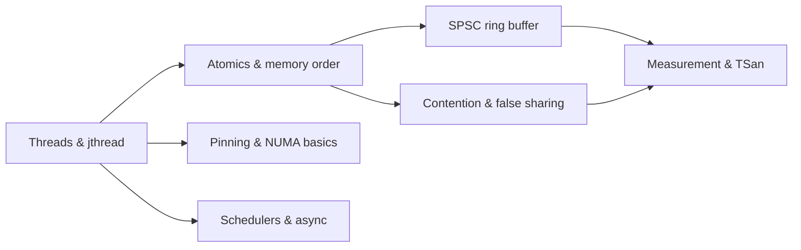

# Module 5 — Concurrency and Parallelism

Why this matters for Lemurian Labs
- Model-serving runtimes, JIT compilation, graph execution, and operator fusion all rely on concurrency. Throughput hinges on correct memory ordering, elimination of contention, and avoiding false sharing.
- You must reason precisely about data races, atomic operations, memory orders, and the performance costs of synchronization. Production systems demand evidence: counters, flamegraphs, and sanitizer proofs.

Key outcomes
- Use std::thread and std::jthread correctly; understand join vs detach; scope-based cancellation with stop_token.
- Build a correct SPSC (single-producer single-consumer) ring buffer using atomics and memory orders; justify correctness with happens-before edges.
- Detect contention and false sharing in counters; fix with padding and local aggregation; quantify scaling.
- Understand futures/async basics, coroutines overview, and task schedulers; identify when they help and when they harm hot loops.
- Measure concurrency with perf, TSan, flamegraphs; pin threads; avoid noisy neighbor effects.

Concept map


Prerequisites and environment
- Linux, clang 17+ or gcc 12+, CMake 3.24+.
- perf, ThreadSanitizer (TSan), flamegraph scripts (optional).
- Lab directory: [C++_Lecture/labs/m05_concurrency/](C++_Lecture/labs/m05_concurrency/README.md)

Reference to labs for this module
- CMake: [C++_Lecture/labs/m05_concurrency/CMakeLists.txt](C++_Lecture/labs/m05_concurrency/CMakeLists.txt)
- SPSC ring buffer bench: [C++_Lecture/labs/m05_concurrency/src/spsc_ring_bench.cpp](C++_Lecture/labs/m05_concurrency/src/spsc_ring_bench.cpp)
- Contention counters demo (TSan optional): [C++_Lecture/labs/m05_concurrency/src/counters_contention.cpp](C++_Lecture/labs/m05_concurrency/src/counters_contention.cpp)

---

## Core content

1) Threads, jthread, and lifecycle (RAII for threads)
- std::thread launches a new thread of execution. You must join or detach; failing to join leads to std::terminate on destruction.
- std::jthread (C++20) joins on destruction and supports cooperative cancellation via std::stop_token. This aligns with RAII and reduces leaks in error paths.
- Cancellation patterns:
  - Pass std::stop_token into worker loops; periodically check stop_requested() to exit cleanly.
  - Never rely on detaching for long-lived background threads in tests or benchmarks; it hides lifetime bugs and complicates measurement.
- Pinning and affinity: Use taskset or sched_setaffinity to stabilize measurements and reduce migration noise; pair with isolcpus if needed. Combine with first-touch initialization (Module 3) to keep pages local to the running thread.

2) Atomics and memory orders in practice (HB edges and visibility)
- Atomics provide two key properties: atomicity (no torn reads/writes) and ordering (visibility constraints).
- Key orders:
  - relaxed: atomicity only. No ordering or synchronization with other operations.
  - acquire on loads: subsequent reads/writes cannot be hoisted above the acquire.
  - release on stores: prior reads/writes cannot be sunk below the release.
  - acq_rel: both acquire and release semantics on read-modify-write.
  - seq_cst: strongest, imposes a single total order on all seq_cst operations (more expensive and harder to scale).
- Happens-before (HB): A release on one atomic synchronizes-with an acquire that reads the value, creating HB from writer’s prior actions to the reader’s subsequent actions.
- Fences: atomic_thread_fence(order) enforces ordering without data movement. Prefer acquire/release on the data or flag atomics; use fences only when designing low-level protocols that require separating data and control atomics.
- Data race definition: two conflicting accesses (at least one write) to the same scalar object without HB relation is a data race. C++ deems this UB; TSan detects potential races dynamically.

3) Lock-free queues and the SPSC ring buffer (correctness and performance)
- SPSC ring buffer invariants:
  - Two indices head and tail; producer advances head, consumer advances tail.
  - Producer sees buffer full if next(head) == tail; consumer sees buffer empty if head == tail.
  - Slots are logically owned by producer when not-yet-published; once head is advanced (release), consumer can safely read with acquire.
- Memory ordering for SPSC:
  - Producer: write element payload into slot (regular stores), then publish with head.store(next, memory_order_release).
  - Consumer: observe publish with head.load(memory_order_acquire); if not empty, read payload, then retire with tail.store(next, memory_order_release).
  - Using relaxed for head/tail breaks HB; consumer may see head change without seeing payload writes (TSan flags race if data is non-atomic).
- Padding for coherence:
  - Place head and tail on distinct cache lines (alignas(64) and pad), and avoid colocating payload arrays and indices on the same line to reduce coherence traffic.
- Batching for throughput:
  - Publish multiple elements at once (advance head by batch) to amortize acquire/release costs and reduce invalidation storms.

4) Contention, false sharing, and aggregation (scaling beyond a few threads)
- Hot counters: Using a single shared std::atomic counter in many threads creates a coherence hotspot. Each fetch_add invalidates all sharers; scaling collapses.
- Fixes:
  - Per-thread shards padded to cache line size; combine periodically with a reduction pass (single-threaded or tree-reduction).
  - Local buffering (batch increments per thread) reduces invalidations by an order of magnitude.
  - Distinct counters in separate cache lines are cheaper than adjacent fields in the same line (see Module 3).
- Measurement: Compare IPC, LLC-store-misses, and wall time for shared vs sharded counters across 2/4/8 threads.

5) Futures, async, and coroutines overview (when not to use them)
- std::future/std::async: Do not assume thread-pool semantics; async policy is implementation-defined and can spawn a thread per call. Prefer explicit thread pools for control.
- Coroutines (overview): Good for IO concurrency and structured state machines; avoid in hot CPU-bound loops. Pay attention to allocator usage and ABI: coroutine frames may allocate; measure.
- Task schedulers:
  - Work-stealing pools improve utilization but can cause migration; pinning and NUMA-aware pools may matter for cache locality.
  - Identify whether your kernel benefits from stealing or from affinitized, long-lived workers.

6) Amdahl/Gustafson and performance triage (parallel limits)
- Amdahl’s law: serial fraction limits speedup; measure and shrink serial segments (e.g., logging, allocator locks, JIT warmup).
- Gustafson’s law: scale the problem size to improve parallel efficiency (batching requests); rediscovering natural batching opportunities in runtime pipelines pays off.

7) Measurement workflow for concurrency (repeatable and honest)
- Stabilize the system: pin threads, reduce background noise, lock CPU frequency if possible (governor powersave/performance).
- TSan for correctness: build dedicated TSan targets to expose data races; then re-run without TSan for performance.
- Flamegraphs: perf record -g … | stackcollapse + flamegraph to identify where threads are blocked or spinning; spot lock convoying or scheduler overhead.
- Counters to monitor:
  - context-switches, migrations, cycles, instructions, branch-misses, LLC-load/store-misses, cache-references, stalled-cycles-frontend/back-end (if exposed).

---

## From Rust to C++ bridges

- Send/Sync vs default sharability
  - Rust’s Send/Sync opt-in model prevents accidental sharing. C++ shares by default; you must gate sharing via API and document contracts.
- Arc/Mutex vs shared_ptr/mutex
  - Arc<T> maps to shared_ptr<T> but shared_ptr uses reference counting with different memory ordering guarantees. Reduce shared_ptr use in hot paths; prefer unique_ptr ownership.
- Ordering semantics
  - std::sync::atomic::Ordering (Rust) and std::memory_order (C++) align closely. Both require explicit acquire/release placement to establish HB. Volatile is not synchronization in either language.
- Channels vs ring buffers
  - Rust mpsc hides memory-order details behind safe abstractions. In C++, ensure your SPSC protocol uses correct ordering, padding, and batching.

---

## Hands-on Lab A — SPSC ring buffer throughput (with HB proof)

Goal
- Implement an SPSC ring buffer and benchmark throughput. Prove correctness with acquire/release HB edges and optionally TSan on a variant that intentionally breaks ordering.

Files
- CMake: [C++_Lecture/labs/m05_concurrency/CMakeLists.txt](C++_Lecture/labs/m05_concurrency/CMakeLists.txt)
- Source: [C++_Lecture/labs/m05_concurrency/src/spsc_ring_bench.cpp](C++_Lecture/labs/m05_concurrency/src/spsc_ring_bench.cpp)
- README: [C++_Lecture/labs/m05_concurrency/README.md](C++_Lecture/labs/m05_concurrency/README.md)

Build and run
```bash
cmake -S C++_Lecture/labs/m05_concurrency -B build/m05 \
  -DCMAKE_BUILD_TYPE=Release -DCMAKE_CXX_COMPILER=clang++ \
  -DBENCHMARK_ENABLE_TESTING=OFF -DCMAKE_EXPORT_COMPILE_COMMANDS=ON
cmake --build build/m05 -j

taskset -c 2-3 ./build/m05/spsc_ring_bench --benchmark_min_time=2.0
```

Evidence
- perf stat -d -r 5 taskset -c 2-3 ./build/m05/spsc_ring_bench
- Optional TSan variant (see README) to demonstrate a relaxed-order bug.

---

## Hands-on Lab B — Contended counters: shared vs sharded

Goal
- Demonstrate contention on a shared atomic counter vs sharded per-thread counters padded to cache-line. Quantify scaling with threads.

Files
- Source: [C++_Lecture/labs/m05_concurrency/src/counters_contention.cpp](C++_Lecture/labs/m05_concurrency/src/counters_contention.cpp)
- README: [C++_Lecture/labs/m05_concurrency/README.md](C++_Lecture/labs/m05_concurrency/README.md)

Run
```bash
taskset -c 2-9 ./build/m05/counters_contention --benchmark_min_time=2.0 --benchmark_counters_tabular=true
```

---

## Microbench and profiling checklist (Module 5 focus)

- Flags
  - -O3 -march=native; add -fsanitize=thread for TSan variants (separate targets).
- Pinning
  - taskset or sched_setaffinity to stabilize; numactl if you explore NUMA.
- Counters
  - cycles, instructions, branches, context-switches, LLC load/store misses.
- Evidence bundle
  - ns/op, IPC, scaling plots across thread counts; proof of HB correctness in ring buffer.

---

## Tooling track

- clang-tidy checks
  - concurrency and atomics related: bugprone-*, performance-*, cppcoreguidelines-*, modernize-*.
- Flamegraphs
  - perf record -g + FlameGraph scripts for blocked vs running time attribution.
- Compiler Explorer
  - Confirm hot loops in ring buffer consumer/producer are free of function call overhead and branch mispredictions; check codegen under -O3.

---

## Interview drills

Code reading 1 — Identify race, fix with acquire/release
```cpp
#include <atomic>
int data = 0;
std::atomic<int> flag{0};

void writer(){ data = 42; flag.store(1, std::memory_order_relaxed); }
int reader(){ while(flag.load(std::memory_order_relaxed)==0){} return data; }
```
Prompts
- Explain the data race. Rewrite with release-store on flag and acquire-load in reader, and justify HB.

Code reading 2 — SPSC invariants
```cpp
bool push(...) { auto n = next(head); if (n == tail) return false; buf[head] = v; head = n; return true; }
```
Prompts
- Which stores/loads require release/acquire? How do you avoid false sharing of head and tail?

Rewrite drill
- Convert a shared atomic counter into sharded per-thread counters; write a final aggregation pass; quantify speedup.

Whiteboard snippet (≤15 lines)
- Implement try_push for an SPSC ring buffer with wrap-around and required memory orders.

“Will this be optimized away and why?”
- If head/tail are non-atomics and raced, compilers may assume unsequenced reads/writes and reorder freely. Show how atomics constrain reordering.

---

## Assessment

Short answer (10)
1) Define happens-before and synchronizes-with.
2) Contrast acquire/release vs seq_cst in cost and guarantees.
3) Why can a single shared atomic counter scale poorly?
4) What padding is needed to avoid false sharing of indices and counters?
5) When do you prefer jthread over thread?
6) What does TSan detect and what are its limits?
7) Explain SPSC ring buffer invariants and how ordering enforces correctness.
8) How to stabilize concurrency measurements on Linux?
9) When are futures/async appropriate vs a thread pool?
10) How would you diagnose noisy neighbor interference?

Explain to a peer
- Teach a teammate how acquire/release enforces visibility in an SPSC ring buffer, and show where to place release and acquire in code. Include a two-minute perf measurement plan.

---

## Assets

Cheat-sheet bullets
- Use jthread + stop_token for RAII-friendly threads.
- Avoid shared atomics in hot loops; shard and reduce.
- Place release after writing data; acquire before reading data in consumers.
- Pin threads; warm up; repeat measurements; use perf + flamegraphs.
- Verify correctness with TSan separately from performance runs.

Glossary delta
- happens-before: ordering relation ensuring visibility
- synchronizes-with: relation created by certain atomic operations (e.g., release→acquire)
- SPSC: single producer single consumer
- contention: multiple threads competing for the same resource (cache line, lock, atomic)

Five-minute spaced repetition set
- Q: What does memory_order_release guarantee? A: All prior writes in the thread become visible to another thread that performs a matching acquire and observes the release.
- Q: Why use sharded counters? A: To avoid coherence contention on a single cache line.
- Q: What’s the difference between join and detach? A: join waits for completion; detach releases ownership and runs independently (dangerous for lifetime).
- Q: When to use seq_cst? A: When a global total order is needed; often overkill for well-structured protocols.
- Q: How does TSan help? A: Detects data races dynamically by tracking HB; use on dedicated builds, not on performance runs.

---

## Deliverables for Module 5
- Ring buffer benchmark with HB justification and perf counters.
- Contention benchmark scaling plots and fixes.
- Short write-up connecting memory orders to correctness and performance.

Next module
- Compilers 101 for Practitioners: IR, SSA, passes, codegen, and JIT mental models, with IR/asm-based evidence.