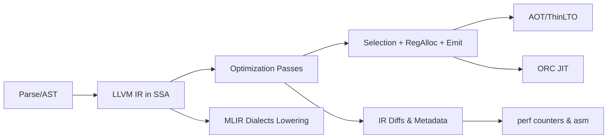

# Module 6 — Compilers 101 for Practitioners

Why this matters for Lemurian Labs
- ML compilers and runtimes live at the IR/codegen boundary. Knowing how the frontend lowers code, how the optimizer reasons (SSA, aliasing, loop transforms), and what codegen expects lets you predict when the compiler will inline, hoist, vectorize, or block your change.
- Being able to read LLVM IR and correlate it with perf counters makes your triage credible: you can show the pass or metadata responsible for a win or regression.
- Understanding AOT vs JIT (ORC) tradeoffs helps you reason about runtime specialization, lazy compilation, and code size vs startup.

Key outcomes
- Explain the compilation pipeline: parse → AST → IR → passes → codegen; define SSA, dominance, and why IR is typed and in SSA form.
- Read small LLVM IR snippets: function/block structure, types, instructions, attributes, metadata (TBAA, fast-math, nsw/nuw), vector types, and GEP.
- Identify evidence of core optimizations in IR: inlining, SROA/mem2reg, GVN/CSE, LICM, unrolling, loop-vectorize, and how aliasing + alignment metadata affect them.
- Run opt pipelines on emitted IR and compare deltas (-O0 vs -O3, with/without fast-math); use llc to compare codegen; map differences to perf counters.
- Describe AOT vs JIT (ORCv2) mental model, symbol resolution, lazy compilation, and LTO/ThinLTO considerations.

Concept map


Prerequisites and environment
- Linux with clang/clang++ 17+ and (optionally) opt and llc installed; CMake 3.24+.
- perf, objdump or llvm-objdump, and text tools for diffs.
- Lab directory: [C++_Lecture/labs/m06_compilers/](C++_Lecture/labs/m06_compilers/README.md)

Reference to labs for this module
- CMake: [C++_Lecture/labs/m06_compilers/CMakeLists.txt](C++_Lecture/labs/m06_compilers/CMakeLists.txt)
- IR safari kernel: [C++_Lecture/labs/m06_compilers/src/kernel_ir.cpp](C++_Lecture/labs/m06_compilers/src/kernel_ir.cpp)
- Fast-math demo: [C++_Lecture/labs/m06_compilers/src/fastmath_demo.cpp](C++_Lecture/labs/m06_compilers/src/fastmath_demo.cpp)
- README: [C++_Lecture/labs/m06_compilers/README.md](C++_Lecture/labs/m06_compilers/README.md)

---

## Core content

1) Compilation pipeline and SSA (how the optimizer “thinks”)
- Frontend to IR
  - The C++ frontend parses to an AST, performs semantic checks, and lowers to LLVM IR, a typed, SSA-based intermediate representation. IR abstracts the target while being close enough to enable codegen-friendly optimizations.
  - SSA (Static Single Assignment) means each virtual register is assigned once; control flow merges with phi nodes select incoming values per predecessor block.
- Why SSA
  - Simplifies dataflow reasoning: constant propagation, GVN (Global Value Numbering), LICM (Loop Invariant Code Motion), and DCE (Dead Code Elimination) become straightforward over SSA graphs.
  - Dominance and loop structure: dominance trees identify which blocks dominate others; loop nests and latch headers guide loop transforms (rotation, unswitching, unrolling, vectorization).
- Alias analysis and memory dependence
  - TBAA (Type-Based Alias Analysis) metadata attaches type hierarchies to loads/stores, allowing the optimizer to assume non-aliasing across incompatible types (see Module 2).
  - MemorySSA models memory effects as a def/use graph, enabling reordering and redundancy elimination when safe. Barriers (calls with side effects, volatile, atomics) constrain motion.
- Typical pipeline sketch
  - IR canonicalization (instcombine, simplifycfg), scalar transforms (SROA/mem2reg turning allocas into SSA registers), inlining (cost heuristics), GVN/CSE, LICM, loop rotation/simplify, vectorization (loop/SLP), unroll, and late codegen-prep passes.
- Code generation
  - Instruction selection (SelectionDAG/GlobalISel) lowers IR to target ISel DAG, followed by register allocation (linear scan or graph coloring variants), scheduling, and emission of machine code. Flags like -march and -mtune select ISA and tuned scheduling.

2) Reading LLVM IR (syntax, semantics, and metadata you must recognize)
- Structure
  - Module contains global declarations, function definitions; each function has basic blocks; each block ends with a terminator (br, ret, switch).
  - Types are explicit: i32, i64, float, double, <N x T> for vector types; pointers are typed (addrspace usually 0 on CPU).
- Key instructions
  - phi merges values: %x = phi i32 [ %fromA, %A ], [ %fromB, %B ]
  - getelementptr (gep) computes addresses; it is purely address arithmetic—does not load/store itself. Pay attention to inbounds and alignment on loads/stores using the result.
  - add/mul/sub with nsw/nuw flags encode “no signed/unsigned wrap” assumptions enabling strength reduction/loop transforms.
  - fadd/fmul/etc. with fast-math flags (fast, nnan, ninf, nsz, arcp, contract) allow algebraic identities and reordering. Enabling these increases optimizer freedom and risks numerical differences.
- Attributes and metadata
  - Function attributes: nounwind, noinline/alwaysinline, optsize, cold/hot impact inlining/scheduling.
  - Param/ret attributes: noalias, nonnull, readonly/readnone, align. Strongly influence alias analysis and vectorizer safety.
  - !tbaa: type-based alias analysis tags; !range, !alias.scope and !noalias sets, !llvm.loop carry loop hints (vectorize.enable, unroll.count).
- Vectorization evidence
  - Inner loops showing <8 x float> loads/stores and shufflevector indicate loop or SLP vectorization. Lack thereof often correlates with potential aliasing, misalignment, or non-unit stride.

3) Optimization passes and their fingerprints in IR
- Inlining: Call sites disappear; callee body appears with promoted allocas (mem2reg). Excess inlining bloats code; inspect size/nm.
- SROA/mem2reg: Allocas and loads/stores vanish; scalars appear as SSA registers; GEP on alloca reduced; phi nodes in loops proliferate.
- GVN/CSE: Redundant computations replaced by a single SSA value; repeated loads may disappear if alias analysis proves no intervening writes.
- LICM: Invariant computations hoisted from loops into preheaders; look for fewer instructions in loop body.
- Loop vectorize/unroll: Loops rewritten with vector types or duplicated bodies; check !llvm.loop metadata for transformed hints.
- Codegen prep: Intrinsics introduced (llvm.smax/min/expansion), address modes merged (gep folded into load/store), alignment asserted via assume/aligned.

4) Fast math policy and its risks
- Flags (fast, reassoc, ninf, nnan, nsz, arcp) expand algebraic identities: fma fusion, reciprocal approximations, reassociation, and contraction.
- Benefits: Vectorizer can combine operations more freely; LICM can move computations; division/sqrt replaced by Newton-Raphson iterations or rsqrt/rcp sequences.
- Risks: Non-IEEE behavior; NaN/Inf sensitivity; reductions become order-dependent; test tolerances and denormals treatment (-ffast-math implies -fno-math-errno among others).

5) AOT vs JIT (ORC), and LTO/ThinLTO
- AOT: Compile ahead of time with target-specific features; -march=native for local tests, tune for deployment target; LTO and ThinLTO enable cross-TU inlining and global DCE.
- JIT (ORCv2): Build a Session, link layers, and JITDylib; supports lazy compilation (compile on first call), ORC object linking, and custom symbol resolution. Useful for runtime specialization of kernels or heuristic-chosen variants.
- ThinLTO: Scalable summary-based whole-program optimization; inlines hot functions across TUs with link-time cost modeling; verify size/runtime tradeoffs.

6) MLIR mental model
- MLIR provides multi-level IR (dialects) for representing high-level ops (linalg, affine, arith) and systematically lowering to LLVM IR.
- Advantages: Tiling, fusion, vectorization captured as dialect transforms before lowering; shapes/types remain explicit longer to guide transforms.
- Takeaway: Many “codegen choices” are better expressed in MLIR dialects; reading lowered LLVM IR confirms the final form, but intent lives in higher dialects.

7) Evidence workflow
- Emit IR with clang -S -emit-llvm at -O0 and -O3; run opt pipelines (-passes=...) and diff IR to identify transforms.
- Use llc to generate asm for both variants; annotate hot loops with perf annotate or objdump; tie counters (IPC, cache-misses) to IR/asm deltas.
- Keep reproducibility: record exact flags (fast-math sets, -march, inlining hints), and lock down inputs (problem sizes) when comparing.

---

## From Rust to C++ bridges

- MIR vs LLVM IR
  - Rust compiles to MIR before LLVM IR; both languages end up using LLVM for many backends. MIR borrow checking and noalias carry into IR more explicitly than in C++; C++ must rely on TBAA and attributes.
- Monomorphization
  - Rust generics and C++ templates both instantiate specialized code. Whole-program optimization and visibility of call sites drive inlining in both ecosystems.
- Panic/abort vs exceptions
  - Rust often compiles with panic=abort in release; C++ exceptions may still emit EH tables. For kernels, many projects disable EH/RTTI to reduce size/overhead; compare IR/asm footprint.

---

## Hands-on Lab A — IR safari: From C++ to IR to asm

Goal
- Produce LLVM IR for a simple kernel; run a selective pass pipeline; inspect differences between -O0 and -O3 and with/without fast-math. Lower to asm to confirm vectorization and instruction selection.

Files
- CMake: [C++_Lecture/labs/m06_compilers/CMakeLists.txt](C++_Lecture/labs/m06_compilers/CMakeLists.txt)
- Source: [C++_Lecture/labs/m06_compilers/src/kernel_ir.cpp](C++_Lecture/labs/m06_compilers/src/kernel_ir.cpp)
- README: [C++_Lecture/labs/m06_compilers/README.md](C++_Lecture/labs/m06_compilers/README.md)

Procedure
```bash
# Build the demo binaries
cmake -S C++_Lecture/labs/m06_compilers -B build/m06 -DCMAKE_BUILD_TYPE=Release -DCMAKE_CXX_COMPILER=clang++
cmake --build build/m06 -j

# Emit IR at different opt levels
clang++ -std=c++23 -O0 -S -emit-llvm C++_Lecture/labs/m06_compilers/src/kernel_ir.cpp -o /tmp/k0.ll
clang++ -std=c++23 -O3 -S -emit-llvm -march=native C++_Lecture/labs/m06_compilers/src/kernel_ir.cpp -o /tmp/k3.ll

# Run passes and compare
opt -passes="default<O3>,loop-vectorize" /tmp/k0.ll -S -o /tmp/k0o3.ll
opt -passes="print<loops>" -disable-output /tmp/k3.ll 2> /tmp/loops.txt

# Lower to asm
llc -O3 -mcpu=native /tmp/k3.ll -o /tmp/k3.s
```
What to inspect
- Presence of phi for loops, SROA removing allocas, vector types <N x T>, fast-math flags if enabled, TBAA tags. In asm, check vector loads/stores, fused ops (vfmadd, etc.).

---

## Hands-on Lab B — Fast-math policy exploration

Goal
- Toggle precise vs fast math and see IR/asm differences (contracted FMA, reciprocal approximations). Observe numerical deltas and performance differences.

Files
- Source: [C++_Lecture/labs/m06_compilers/src/fastmath_demo.cpp](C++_Lecture/labs/m06_compilers/src/fastmath_demo.cpp)
- README: [C++_Lecture/labs/m06_compilers/README.md](C++_Lecture/labs/m06_compilers/README.md)

Procedure
```bash
# Precise
clang++ -std=c++23 -O3 -S -emit-llvm C++_Lecture/labs/m06_compilers/src/fastmath_demo.cpp -o /tmp/fprec.ll
# Fast math
clang++ -std=c++23 -O3 -ffast-math -fno-math-errno -fno-trapping-math -S -emit-llvm C++_Lecture/labs/m06_compilers/src/fastmath_demo.cpp -o /tmp/ffast.ll

# Diff IR and lower to asm
diff -u /tmp/fprec.ll /tmp/ffast.ll | less
llc -O3 -mcpu=native /tmp/ffast.ll -o /tmp/ffast.s
```
What to observe
- IR carries fast-math flags on fmul/fadd or calls become @llvm.fma.* intrinsics; asm shows fused multiply-add instructions.

---

## Microbench and profiling checklist (Module 6 focus)

- Flags
  - -O0 vs -O3, -march=native, -ffast-math variants; optionally -fno-exceptions -fno-rtti for code size studies.
- Tools
  - opt -passes=..., llc, llvm-objdump -d or objdump -d, perf stat -d, Compiler Explorer for side-by-side IR/asm.
- Evidence bundle
  - IR diffs showing transform fingerprints; asm snippets (vector ops, FMA); counters reflecting the change (IPC up, cycles down).

---

## Tooling track

- clang-tidy focus
  - performance-*, bugprone-*, cppcoreguidelines-*, readability-*, modernize-*, and checks enforcing noexcept correctness for inlining opportunities.
- CI sanity
  - Add a script/target to refresh IR/asm artifacts with pinned flags; record toolchain versions to avoid “moved goalposts” across compilers.

---

## Interview drills

Code reading 1 — Loop in IR
- Given a simple sum loop in IR with phi and icmp/br, identify loop header/latch, invariant code, and where LICM would hoist. Mark opportunities for vectorization.

Code reading 2 — Alias and vectorization blocking
- Given two pointer parameters without noalias, explain why vectorizer bails out. Suggest interface changes (restrict-like) or copy to temporary to enable vectorization.

Rewrite drill
- Refactor a function to expose noalias and alignment facts via attributes (restrict-like qualifiers and std::assume_aligned) and demonstrate the resulting IR/asm change.

Whiteboard snippet (≤15 lines)
- Write a short C++ loop and annotate what IR you expect (phi, gep, load/store, add, br). Explain how SROA would eliminate stack traffic.

“Will this be optimized away and why?”
- If metadata signals non-aliasing and fast math, common subexpressions are folded aggressively. Argue when to turn off fast math to preserve numerical properties.

---

## Assessment

Short answer (10)
1) Define SSA and why phi nodes are needed.
2) What do nsw/nuw mean and how do they aid optimization?
3) What is TBAA metadata and where does it matter?
4) How does LICM decide what to hoist?
5) Give two reasons why a loop might not vectorize.
6) What’s the difference between loop-vectorize and SLP vectorize?
7) What do fast-math flags permit and what are the risks?
8) How do -march and -mtune affect codegen?
9) Contrast AOT with JIT (ORC) in startup, footprint, and specialization flexibility.
10) What does ThinLTO add over regular LTO?

Explain to a peer
- In two minutes, explain how a simple sum loop lowers to IR, how mem2reg and LICM transform it, and how vectorization shows up in IR and asm. Include one perf counter you would use to validate a win.

---

## Assets

Cheat-sheet bullets
- SSA + phi + dominance = optimizer’s native language; learn to read it.
- IR fingerprints: SROA removes allocas; LICM hoists; vector types in loops = success.
- Metadata matters: TBAA, noalias, fast-math flags steer major transforms.
- AOT vs JIT: specialize at link/run-time; use ThinLTO for scalable cross-TU wins.
- Record exact flags and tool versions when capturing evidence.

Glossary delta
- SSA: static single assignment form
- phi: IR instruction merging values from predecessors
- LICM: loop-invariant code motion
- TBAA: type-based alias analysis metadata
- ORC JIT: On-Request Compilation, LLVM’s modern JIT framework

Five-minute spaced repetition set
- Q: Why does SSA help GVN? A: Unique definitions and explicit dataflow make equivalence easy to detect.
- Q: What signals vectorization success in IR? A: <N x T> vector ops and wide loads/stores with loop metadata.
- Q: When is fast-math appropriate? A: When small numerical deviations are acceptable and gains are meaningful; document and test.
- Q: Why noalias/noexcept help codegen? A: They tighten aliasing and EH constraints, enabling inlining and reordering.
- Q: What’s ThinLTO’s advantage? A: Summary-based cross-TU optimization with scalable parallel linking.

---

## Deliverables for Module 6
- IR/asm artifacts for the kernel at -O0/-O3 and fast-math variants, with a short narrative tying transforms to counters.
- A brief report noting two IR “smells” that blocked vectorization and how to fix them in code or interfaces.

Next module
- Numerical Kernels & ML Building Blocks in C++: from naive BLAS to tiled microkernels, precision tradeoffs, and roofline thinking.