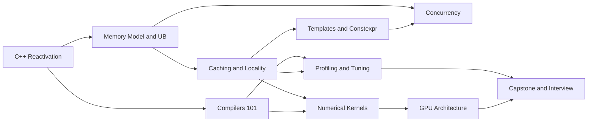

# Modern C++ + Compilers + GPU for ML Systems — Interview-Oriented Program

Phase 1 — Outline (STOP & WAIT)
Total time budget: ~112 hours across 10 modules
Persona anchored: Rust-proficient systems engineer, rusty on C++, minimal LLVM hands-on, needs strong performance intuition and ability to discuss compiler runtime and hardware effects.

Environment assumptions
- Linux host, no CUDA-capable GPU required
- Clang and GCC available; CMake-based builds; minimal deps
- GPU labs provide CPU-only fallbacks SYCL on CPU and measurement-first methodology
- Prefer C++23 where helpful, note portability caveats

Measurement doctrine used throughout
- Compare -O0 vs -O3; sometimes -Og when inspecting
- Use -fno-inline, volatile, gnu::noinline as needed to keep optimizer honest
- Vary -march=native vs baseline targets to expose autovectorization and ABI details
- Inspect IR and asm on Compiler Explorer and locally via clang -S -emit-llvm and objdump
- Stabilize timers: warm caches, pin threads, repeat with statistical summary

Deliverables cadence each module
- Code-reading drills, rewrite drills, one whiteboard snippet at most 15 lines
- Hands-on lab s with CMake, build run measure
- Microbench and profiling evidence perf, valgrind family, sanitizers
- Tooling track checklist clang-tidy clang-format include-what-you-use Godbolt deltas
- Rust to C++ bridge bullets for that module
- Checkpoint artifact s feeding Capstone

Dependency map

Module 1 — C++ Reactivation and Tooling
Time: 11h
Learning outcomes
- Rebuild fluency with RAII, value categories, move semantics, and rule of 0 3 5 0
- Use modern build tooling CMake clang gcc vcpkg Conan basics
- Apply clang-tidy clang-format include-what-you-use to small codebases
- Read and reason about small C++23 snippets, predict UB or optimization outcomes
- Use Godbolt to compare codegen across flags and compilers
Key labs
- CPU: Reactivation microbench. Implement copy vs move vs emplace patterns on small containers. Measure -O0 vs -O3 with Google Benchmark and inspect asm and attribute driven inlining
- GPU alt: SYCL on CPU warm up. Vector add and reduce, compare single task vs nd range overheads on CPU backend
Primary tools
- clang, gcc, cmake, clang-tidy, clang-format, include-what-you-use, Compiler Explorer, Google Benchmark
Interview mapping
- Read unfamiliar code, identify lifetime mistakes, explain elision RVO and when moves occur
- Discuss error handling tradeoffs exceptions vs error codes at boundaries
Checkpoint
- Working repo with CMake skeleton, style tools wired, microbench harness validated
- Rust to C++ bridges ownership vs RAII, move vs borrow, panic vs exceptions

Module 2 — Memory Model, UB, Aliasing, Object Lifetimes
Time: 13h
Learning outcomes
- Explain strict aliasing, alignment, padding, and standard layout constraints
- Distinguish const and volatile semantics and recognize as if rule constraints
- Identify data races and use atomics and memory orders at a conceptual level
- Use new delete placement new safely and reason about lifetime and storage duration
- Recognize and eliminate common UB patterns and use sanitizers to surface bugs
Key labs
- CPU: Aliasing and type punning. Demonstrate UB via pointer casts vs std::bit_cast and show optimizer miscompilations under -O3 and fix with type traits and aliasing barriers and measure impact
- CPU: Atomic memory order playground. Implement a message flag with relaxed acquire release and show when it fails under TSan and then fix and document reasoning
- GPU alt: SYCL buffer vs USM aliasing thought experiments on CPU backend and map semantics to C++ lifetimes
Primary tools
- UBSan, ASan, TSan, objdump, perf stat, cachegrind, Compiler Explorer
Interview mapping
- Spot the UB drills, explain why volatile does not provide inter thread ordering
- Reason about RVO, temporary lifetimes, and placement new use cases
Checkpoint
- UB hotspot checklist and small examples with sanitizer proofs
- Rust to C++ bridges borrowing aliasing rules vs C++ aliasing freedom, lifetimes vs storage duration and RAII

Module 3 — Caching, Locality and Core Allocation
Time: 13h
Learning outcomes
- Describe cache lines, associativity, prefetching, and replacement effects
- Diagnose false sharing and use padding and alignment to prevent it
- Improve locality with SoA vs AoS, tiling blocking, and iteration order fixes
- Understand NUMA and thread pinning and know when to use taskset and numactl
- Interpret autovectorization reports and control with flags and pragmas when justified
Key labs
- CPU: AoS vs SoA sweep. Implement traversal microbench across sizes, show LLC thrash and speedups with tiling, measure with perf stat and cachegrind
- CPU: False sharing demo. Two threads updating adjacent counters, reveal via perf and TSan, fix with alignas and padding, quantify
- GPU alt: Coalescing by analogy. Strided vs contiguous access pattern microbench on CPU, relate to warp level coalescing
Primary tools
- perf stat record, valgrind cachegrind callgrind, taskset, numactl, -march=native
Interview mapping
- Rewrite for locality, explain why branch prediction and prefetching matter, define restrict analogs and aliasing barriers in C++
Checkpoint
- Affinity script and locality refactor write up with before after data
- Rust to C++ bridges iterator adapters vs range pipelines, aliasing defaults vs borrow checker guarantees

Module 4 — Templates, Constexpr, Concepts, and Metaprogramming for Performance
Time: 11h
Learning outcomes
- Use concepts constraints to express requirements and replace SFINAE
- Apply CRTP for static polymorphism and compare to virtual dispatch
- Write constexpr paths and compile time dispatch and understand ABI and inlining effects
- Exploit EBO and layout control and know variant optional costs
Key labs
- CPU: CRTP vs virtual benchmark. Implement two designs, measure call overhead, inlining, and code size, inspect asm
- CPU: Concept constrained algorithm choosing specialized kernels, compile time tile sizes, compare to runtime dispatch
- GPU alt: Template parameterized tile size selection for CPU kernel and tie to GPU block size selection thinking
Primary tools
- Compiler Explorer, -ftime-trace, nm, objdump, size, clang-tidy modernize checks
Interview mapping
- Argue for static vs dynamic polymorphism under hot loops and show how concepts improve readability and codegen
Checkpoint
- Template performance cheat sheet with do and do not guidance
- Rust to C++ bridges traits vs concepts, monomorphization similarities, zero cost abstraction expectations

Module 5 — Concurrency and Parallelism
Time: 10h
Learning outcomes
- Use std::thread and jthread and atomics correctly and choose memory orders intentionally
- Implement a simple lock free SPSC queue and reason about correctness
- Recognize false sharing and contention in concurrent code and mitigate
- Understand futures async and coroutines overview for tasking and IO
Key labs
- CPU: SPSC ring buffer with atomics. Validate with tests, benchmark throughput, explore memory orders, use TSan
- CPU: False sharing vs padding in counters under contention, measure
- GPU alt: Overlap copy compute simulation on CPU threads and SYCL queue events on CPU backend
Primary tools
- std::atomic, TSan, perf record, flamegraphs, thread pinning
Interview mapping
- Whiteboard a ring buffer, justify memory orders, discuss tradeoffs of coroutines vs threads for ML serving
Checkpoint
- Short report mapping memory order to required happens before edges
- Rust to C++ bridges Send Sync analogies, unsafe vs UB, ownership handoff vs move semantics in concurrency

Module 6 — Compilers 101 for Practitioners
Time: 11h
Learning outcomes
- Define frontend IR SSA passes register allocation and codegen pipeline
- Read LLVM IR for small kernels and identify GVN LICM unrolling vectorization evidence
- Understand AOT vs JIT and ORC JIT basics and link time optimization constraints
- Get a mental model for MLIR dialects and lowering to LLVM IR
Key labs
- CPU: IR safari. Build a simple kernel, dump emit llvm, run opt passes and diff IR, feed to llc, compare asm across flags
- CPU: Write a tiny analysis pass with new pass manager that counts loads and stores and run via opt
- GPU alt: Fast math flags from C++ to IR and show relaxed math effects and hazards
Primary tools
- clang, opt, llc, llvm dwarfdump, mllvm pass pipeline flags, MLIR docs reading
Interview mapping
- Talk through how a compiler decides to inline, hoist, or unroll and explain SSA and why it matters for optimization
Checkpoint
- One page IR reading guide with annotated example and pass list
- Rust to C++ bridges MIR and LLVM IR differences and Rust monomorphization vs C++ templates

Module 7 — Numerical Kernels and ML Building Blocks in C++
Time: 11h
Learning outcomes
- Implement naive and blocked GEMM and reason about register blocking and cache reuse
- Build efficient reductions and softmax and understand denormals and fast math implications
- Compare precision modes and their performance consequences
Key labs
- CPU: GEMM journey. Start naive O3, add blocking tiling register reuse, measure at each step, compare to reference BLAS if available
- CPU: Softmax with log sum exp stabilization, reduce vectorization, measure exact vs fast math
- GPU alt: SYCL reduction on CPU, explore work group sizes, discuss occupancy analogy
Primary tools
- Google Benchmark, perf, callgrind, Compiler Explorer
Interview mapping
- Explain arithmetic intensity and blocking, connect to roofline, reason about precision tradeoffs for ML inference
Checkpoint
- Kernel write ups with flamegraphs and cachegrind evidence and roofline estimate vs measured
- Rust to C++ bridges iterators vs raw loops and unsafe blocks vs bounds unchecked kernels

Module 8 — GPU Architecture and Programming Model CPU Friendly
Time: 11h
Learning outcomes
- Describe warps wavefronts, occupancy, divergence, and memory coalescing
- Use shared memory concepts and bank conflict avoidance patterns conceptually
- Manage host device transfers costs and know pinned memory and async copy concepts
- Contrast CUDA HIP SYCL models and write simple SYCL kernels for CPU backend
Key labs
- GPU alt: SYCL on CPU. Vector add and strided access and measure group size effects and control divergence like behavior with branches
- GPU alt: Emulate occupancy tradeoffs with thread pool batch sizes and discuss scheduler and oversubscription
Primary tools
- DPCPP oneAPI or hipSYCL, Nsight Systems Compute docs reading, SYCLomatic references
Interview mapping
- Explain why divergence and uncoalesced accesses kill throughput and reason about stream overlap and staged pipelines
Checkpoint
- GPU rules of thumb cheat sheet tied back to CPU analogies
- Rust to C++ bridges async executors vs SYCL queues and lifetimes vs buffer ownership

Module 9 — Profiling, Debugging, and Tuning Workflow
Time: 10h
Learning outcomes
- Use perf stat record annotate to identify hotspots and stalls
- Use valgrind callgrind cachegrind to attribute compute vs memory
- Apply sanitizers ASan UBSan TSan MSan and heaptrack for dynamic diagnostics
- Build flamegraphs and apply a triage checklist and understand roofline analysis
Key labs
- CPU: Perf guided tuning. Pick a kernel from earlier modules, record and annotate, propose change, validate gains
- CPU: Sanitizer safari. Seed memory UB, catch and fix, document
- GPU alt: Study published Nsight reports and map metrics to CPU analogs
Primary tools
- perf, valgrind family, heaptrack, FlameGraph scripts, gdb and lldb basics
Interview mapping
- Walk an interviewer through a performance triage from symptom to fix and communicate evidence and tradeoffs
Checkpoint
- Tuning checklist and before after commit summaries with numbers
- Rust to C++ bridges panic backtraces vs sanitizers and cargo bench vs Google Benchmark harnesses

Module 10 — Capstone Integration and Interview Prep
Time: 11h
Learning outcomes
- Integrate memory, locality, templates, and concurrency into a focused kernel
- Produce a clear measurement narrative with IR and asm evidence
- Practice code reading and speaking aloud about UB and optimization opportunities
- Rehearse two full conversational technical interviews with rubrics
Key labs
- CPU Capstone: Fused softmax followed by tiled matmul microkernel. Start from naive, apply blocking vectorization and aliasing constraints, measure across machines and flags
- GPU alt: SYCL CPU pipeline variant with staged queues and discuss where coalescing and divergence would appear on real GPU
Primary tools
- All prior tools plus a clean repo structure for deliverables and scripts for runs
Interview mapping
- Simulation of Lemurian style conversations: C++ code reading, cache locality reasoning, UB identification, quick rewrite suggestions, and compiler IR inspection
Capstone checkpoint
- Final report including problem framing, baseline numbers, stepwise improvements with profiling evidence, IR and asm diffs for key transforms, and a concise rule of thumb summary
- Assets bundle cheat sheets, glossary deltas, and spaced repetition cards 5 minutes set

Program references official and free
- cppreference main pages for language and library
- LLVM docs Getting Started and Language Reference for LLVM IR and Passes reference and ORC JIT overview
- MLIR docs and Toy tutorial articles
- SYCL 2020 reference and oneAPI DPC++ guide resources
- Valgrind and Linux perf wiki and FlameGraph repo
- Google Benchmark and GoogleTest docs

Scope control and time accounting
- Modules sum to about 112 hours including reading, labs, profiling, and drills
- Each module ends with interview drills and an artifact deliverable to feed Capstone

STOP POINT
This outline is Phase 1. On approval, each module becomes a Chapter with Lemurian context, key outcomes, concept map, core content, Rust to C++ bridges, hands on lab with CMake, microbench and profiling, tooling track, interview drills, and assessment.